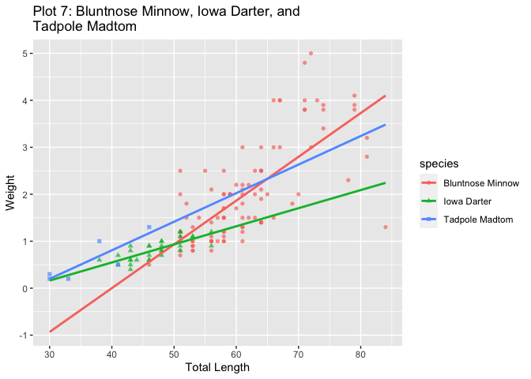

Bio Dataset EDA
================
Yu-Wei Hsu

This project is intended to demonstrate skills to process data, present
the data visually, and calculate basic statistics; all with explanatory
analysis.  
Expected learning outcomes:  
- Calculate counts and probabilities based on categorical data - Graph
probability distributions - Use R to manipulate dataset - Interpret data
displayed in graphs

### Import Libraries

``` r
library(FSA)
```

    ## ## FSA v0.8.30. See citation('FSA') if used in publication.
    ## ## Run fishR() for related website and fishR('IFAR') for related book.

``` r
library(FSAdata)
```

    ## ## FSAdata v0.3.8. See ?FSAdata to find data for specific fisheries analyses.

``` r
library(magrittr)
library(dplyr)
```

    ## 
    ## Attaching package: 'dplyr'

    ## The following objects are masked from 'package:stats':
    ## 
    ##     filter, lag

    ## The following objects are masked from 'package:base':
    ## 
    ##     intersect, setdiff, setequal, union

``` r
library(tidyr)
```

    ## 
    ## Attaching package: 'tidyr'

    ## The following object is masked from 'package:magrittr':
    ## 
    ##     extract

``` r
library(tidyverse)
```

    ## ── Attaching packages ─────────────────────────────────────── tidyverse 1.3.0 ──

    ## ✓ ggplot2 3.3.5     ✓ purrr   0.3.4
    ## ✓ tibble  3.0.3     ✓ stringr 1.4.0
    ## ✓ readr   1.3.1     ✓ forcats 0.5.0

    ## ── Conflicts ────────────────────────────────────────── tidyverse_conflicts() ──
    ## x tidyr::extract()   masks magrittr::extract()
    ## x dplyr::filter()    masks stats::filter()
    ## x dplyr::lag()       masks stats::lag()
    ## x purrr::set_names() masks magrittr::set_names()

### Load Data

``` r
setwd("~/Desktop/Github/R")
bio <- read.csv("inchBio.csv")
```

### Overview

``` r
headtail(bio,3)
```

    ##     netID fishID       species  tl     w  tag scale
    ## 1      12     16      Bluegill  61   2.9      FALSE
    ## 2      12     23      Bluegill  66   4.5      FALSE
    ## 3      12     30      Bluegill  70   5.2      FALSE
    ## 674   110    863 Black Crappie 307 415.0 1783  TRUE
    ## 675   129    870 Black Crappie 279 344.0 1789  TRUE
    ## 676   129    879 Black Crappie 302 397.0 1792  TRUE

``` r
str(bio)
```

    ## 'data.frame':    676 obs. of  7 variables:
    ##  $ netID  : int  12 12 12 12 12 12 12 13 13 13 ...
    ##  $ fishID : int  16 23 30 44 50 65 66 68 69 70 ...
    ##  $ species: chr  "Bluegill" "Bluegill" "Bluegill" "Bluegill" ...
    ##  $ tl     : int  61 66 70 38 42 54 27 36 59 39 ...
    ##  $ w      : num  2.9 4.5 5.2 0.5 1 2.1 NA 0.5 2 0.5 ...
    ##  $ tag    : chr  "" "" "" "" ...
    ##  $ scale  : logi  FALSE FALSE FALSE FALSE FALSE FALSE ...

``` r
summary(bio)
```

    ##      netID            fishID        species                tl       
    ##  Min.   :  1.00   Min.   :  7.0   Length:676         Min.   : 27.0  
    ##  1st Qu.: 13.00   1st Qu.:175.8   Class :character   1st Qu.: 66.0  
    ##  Median : 37.00   Median :345.5   Mode  :character   Median :189.5  
    ##  Mean   : 67.65   Mean   :434.2                      Mean   :186.5  
    ##  3rd Qu.:109.00   3rd Qu.:695.5                      3rd Qu.:295.0  
    ##  Max.   :206.00   Max.   :915.0                      Max.   :429.0  
    ##                                                                     
    ##        w              tag              scale        
    ##  Min.   :   0.2   Length:676         Mode :logical  
    ##  1st Qu.:   2.0   Class :character   FALSE:213      
    ##  Median :  54.5   Mode  :character   TRUE :463      
    ##  Mean   : 126.8                                     
    ##  3rd Qu.: 190.5                                     
    ##  Max.   :1070.0                                     
    ##  NA's   :165

Bio(inchBio.csv) dataset illustrates the total length and weight of
various species fishes over 676 records. The following will research on
the total length and weight of eight different species.

### EDA

#### Data manipulating

``` r
# names of species
distinct(bio,species)
```

    ##            species
    ## 1         Bluegill
    ## 2 Bluntnose Minnow
    ## 3      Iowa Darter
    ## 4  Largemouth Bass
    ## 5      Pumpkinseed
    ## 6   Tadpole Madtom
    ## 7     Yellow Perch
    ## 8    Black Crappie

``` r
# create table called w with species variables
w <- table(bio$species)
#class(w)      # check class

# convert w to data frame
t <- as.data.frame(w)
colnames(t)<-c('Species','Freq')
t
```

    ##            Species Freq
    ## 1    Black Crappie   36
    ## 2         Bluegill  220
    ## 3 Bluntnose Minnow  103
    ## 4      Iowa Darter   32
    ## 5  Largemouth Bass  228
    ## 6      Pumpkinseed   13
    ## 7   Tadpole Madtom    6
    ## 8     Yellow Perch   38

``` r
# frequency values from t
t_freq <- pull(t,Freq)        #t$Freq
t_freq
```

    ## [1]  36 220 103  32 228  13   6  38

``` r
# create table named cSpec from bio
cSpec <- table(bio$species)
cSpec
```

    ## 
    ##    Black Crappie         Bluegill Bluntnose Minnow      Iowa Darter 
    ##               36              220              103               32 
    ##  Largemouth Bass      Pumpkinseed   Tadpole Madtom     Yellow Perch 
    ##              228               13                6               38

``` r
# create table cSpecPct with species and percentage
cSpecPct <- prop.table(cSpec)
cSpecPct
```

    ## 
    ##    Black Crappie         Bluegill Bluntnose Minnow      Iowa Darter 
    ##       0.05325444       0.32544379       0.15236686       0.04733728 
    ##  Largemouth Bass      Pumpkinseed   Tadpole Madtom     Yellow Perch 
    ##       0.33727811       0.01923077       0.00887574       0.05621302

``` r
# convert cSpecPct table to data frame name u
u <- as.data.frame(cSpecPct)
```

#### Visualization

``` r
# bar plot of cSpec
barplot(cSpec,main = 'Fish Count',ylab = 'COUNTS',
        col = 'light green',las=1,cex.names = 0.6)
```

<!-- -->

``` r
# bar plot of cSpecPct
barplot(cSpecPct, ylim = c(0,0.4),main = 'Fish Relative Frequency')
axis(2,col.axis = 'light blue')
```

<!-- -->

``` r
# sort u data frame in descending order
d <- arrange(u,desc(Freq))

# rename d columns names
colnames(d)<-c('Species','RelFreq')
d
```

    ##            Species    RelFreq
    ## 1  Largemouth Bass 0.33727811
    ## 2         Bluegill 0.32544379
    ## 3 Bluntnose Minnow 0.15236686
    ## 4     Yellow Perch 0.05621302
    ## 5    Black Crappie 0.05325444
    ## 6      Iowa Darter 0.04733728
    ## 7      Pumpkinseed 0.01923077
    ## 8   Tadpole Madtom 0.00887574

``` r
# add cumfreq, count and cumcounts
d$cumfreq = cumsum(d$RelFreq)
d$counts = sort(t_freq,decreasing = TRUE)
d$cumcounts = cumsum(d$counts)
#d <- transform(d,
#               cumfreq = cumsum(RelFreq),
#               counts = sort(t_freq,decreasing = TRUE),   #different data frame
#               cumcounts =cumsum(counts))
d
```

    ##            Species    RelFreq   cumfreq counts cumcounts
    ## 1  Largemouth Bass 0.33727811 0.3372781    228       228
    ## 2         Bluegill 0.32544379 0.6627219    220       448
    ## 3 Bluntnose Minnow 0.15236686 0.8150888    103       551
    ## 4     Yellow Perch 0.05621302 0.8713018     38       589
    ## 5    Black Crappie 0.05325444 0.9245562     36       625
    ## 6      Iowa Darter 0.04733728 0.9718935     32       657
    ## 7      Pumpkinseed 0.01923077 0.9911243     13       670
    ## 8   Tadpole Madtom 0.00887574 1.0000000      6       676

Let’s look at the frequency and numbers of eight species. As we can see,
the numbers of species we have in the dataset are in a wide range; only
two species fishes over 200 records, Largemouth Bass and Bluegill, and
some species have fewer than 20 records. We can slice the dataset into
two subsets with a similar amount of data to analyze; one includes the
species with **over 200** data and another with the number **range in 30
to 40**(Yellow Perch, Black Crappie, and Iowa Darter).

``` r
def_par <- par(no.readonly = T)

# bar plot called pc
pc <- barplot(na.omit(d$counts), width = 1, space = .15,
        axes = F, ylim = c(0,3.05*max(d$counts)),
        main = 'Species Pareto', ylab = 'Cumulative Counts', 
        names.arg = d$Species, las=2, cex.names = 0.7,)

# add cumulative counts line 
lines(x = pc,y= d$cumcounts,type = 'b',pch=19,col='cyan4')
text(x=pc,y=d$cumcounts,labels = d$cumcounts,cex=.7,pos=1)

# grey box
box(col='grey')

# left axis
axis(2,at= c(0,d$cumcounts),col='grey62',col.axis = 'grey62',
     col.ticks = 'grey62',cex=.8,las=1)

# right axis
label_cumfreq <- paste(c(0,round(d$cumfreq*100,0)),"%",sep='')
#label_cumfreq
axis(4,at= c(0,d$cumcounts),label_cumfreq,
     col='cyan4',col.axis = 'cyan4',las=1,cex=.8)

# display with watermark
mtext("Hsu",side = 3,line = -1,adj=0,col=rgb(0,0,1,.5),cex=1.3)
```

<!-- -->

``` r
par(def_par)
```

``` r
# boxplot of weight by species
# remove missing values in bio
bio1<-na.omit(bio)

# boxplots of weight and tptal length by Species
ggplot(bio1,aes(x=species, y=w,color=species))+
  geom_boxplot(notch = TRUE)+
  ggtitle("Plot 1: Boxplot of Weight by Species") +
  ylab("Weight") + xlab("Speices")+
  theme(axis.text.x = element_text(size=7, angle=60))
```

    ## notch went outside hinges. Try setting notch=FALSE.
    ## notch went outside hinges. Try setting notch=FALSE.

<!-- -->

``` r
ggplot(bio1,aes(x=species, y=tl,color=species))+
  geom_boxplot()+
  ggtitle("Plot 2: Boxplot of Total Length by Species") +
  ylab("Total Length") + xlab("Speices")+
  theme(axis.text.x = element_text(size=7, angle=60))
```

<!-- -->

There are relative averages between each species as two boxplots shown
above. We can not only examine more on the subset mentioned above but
also investigate the species with a similar mean of the total length and
weight: a couple of Balck Crappie and Largemouth Bass, a pair of
Bluegill, Pumpkinseed, and Yellow Perch, and another pair of Bluntnose
Minnow, Iowa Darter, and Tadpole Madtom.

``` r
# pick Largemouth Bass and Bluegill dataset display scatter plot
LB_B <- c('Largemouth Bass','Bluegill')
bio2<-(filter(bio1,species %in% LB_B))
ggplot(bio2,aes(x=tl,y=w,group=species))+
  geom_point(aes(shape=species,color=species))+
  ggtitle("Plot 3: Largemouth Bass and Bluegill") +
  xlab("Total Length") + ylab("Weight")
```

<!-- -->

``` r
# pick Yellow Perch, Black Crappie, and Iowa Darter dataset display scatter plot
YBI <- c('Yellow Perch','Black Crappie','Iowa Darter')
bio3<-(filter(bio1,species %in% YBI))
#bio3
ggplot(bio3,aes(x=tl,y=w,group=species))+
  geom_point(aes(shape=species,color=species))+
  ggtitle("Plot 4: Yello Perch, Black Crappie, and Iowa Darter") +
  xlab("Total Length") + ylab("Weight")
```

<!-- -->

Plot 3 and plot 4 show the datasets that have a similar number of
records. We can see that the ranges are quite different for both total
length and weight from two datasets. Iowa Darter’s length and weight are
pretty small compared to Black Crappie and Yellow Perch. We can assume
Iowa Darter might be the prey for other species in the same pond based
on their body sizes, and of course, we need further investigation.

``` r
# select Black Crappie and Largemouth Bass dataset 
BL <- c('Black Crappie','Largemouth Bass')
bio4<-(filter(bio1,species %in% BL))
ggplot(bio4,aes(x=tl,y=w,color=species))+
  geom_point(aes(shape=species,color=species),alpha=.7)+
  ggtitle("Plot 5: Black Crappie and Largemouth Bass") +
  xlab("Total Length") + ylab("Weight")+
  geom_smooth(method=lm,se=FALSE,fullrange=TRUE)
```

    ## `geom_smooth()` using formula 'y ~ x'

<!-- -->

``` r
# select Bluegill, Pumpkinseed, and Yellow Perch dataset
BPY <- c('Bluegill','Pumpkinseed','Yellow Perch')
bio5<-(filter(bio1,species %in% BPY))
ggplot(bio5,aes(x=tl,y=w,color=species))+
  geom_point(aes(shape=species,color=species),alpha=.7)+
  ggtitle("Plot 6: Bluegill, Pumpkinseed, and Yellow Perch") +
  xlab("Total Length") + ylab("Weight")+
  geom_smooth(method=lm,se=FALSE,fullrange=TRUE)
```

    ## `geom_smooth()` using formula 'y ~ x'

<!-- -->

``` r
# select Bluntnose Minnow, Iowa Darter, and Tadpole Madtom dataset
BIT <- c('Bluntnose Minnow','Iowa Darter','Tadpole Madtom')
bio6<-(filter(bio1,species %in% BIT))
ggplot(bio6,aes(x=tl,y=w,color=species))+
  geom_point(aes(shape=species,color=species),alpha=.7)+
  ggtitle("Plot 7: Bluntnose Minnow, Iowa Darter, and \nTadpole Madtom") +
  xlab("Total Length") + ylab("Weight")+
  geom_smooth(method=lm,se=FALSE,fullrange=TRUE)
```

    ## `geom_smooth()` using formula 'y ~ x'

<!-- -->

Plot 5, plot 6, and plot 7 display the datasets that have similar mean
between species. We can observe that the regression lines are closed to
others, and some lines even look like parallel (plot5 and red-blue lines
on plot 6). It should be evident from this observation that there is a
connection between the groups with the very close slope of the
regression line, probably have the same role in the ecological pyramid.

### Conclusion

By studying the bio dataset provided, we could analyze that we found
similar species among eight species by their weight and total length.  
- The first couple consists of Black Crappie and Largemouth Bass, which
have bigger sizes with a longer length and heavier weight.  
- The second pair involves Bluegill, Pumpkinseed, and Yellow Perch,
which have a medium range of body sizes compared to the first couple.  
- Finally, we have a group that contains Bluntnose Minnow, Iowa Darter,
and Tadpole Madtom, which have smaller sized correlatedly.
