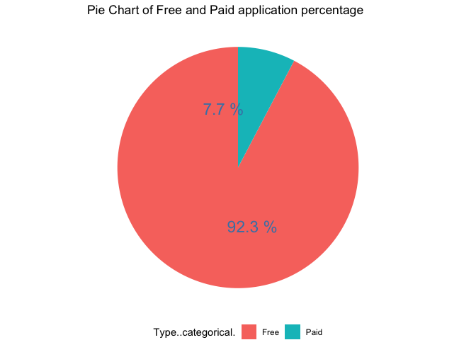
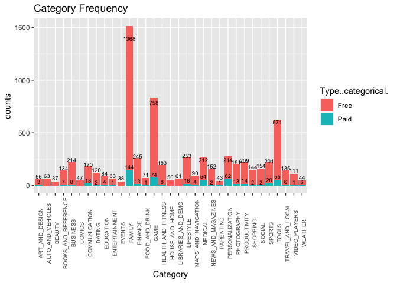
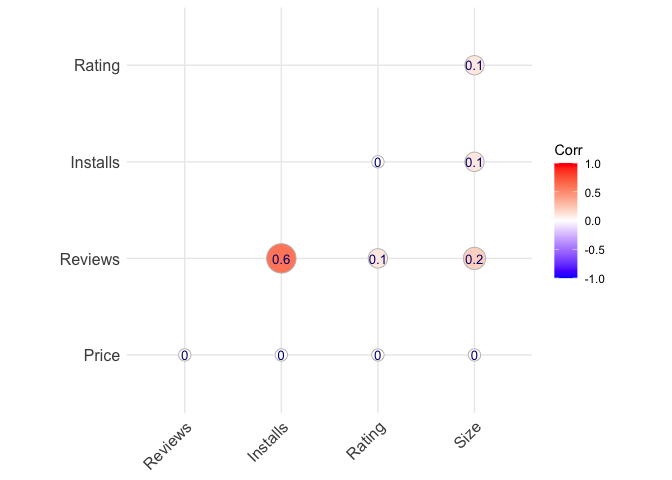

Google Play Store Dataset Analysis
================
Yu-Wei Hsu

This project is intended to familiarize with the dataset and interpret
key business questions from this data.  
Expected learning outcomes:  
1. Identify basic statistics measures of central tendency and variance  
2. Utilize the “R” as a tool set for processing and analyzing basic
data  
3. Demonstrate how the analysis of data impacts operational and
strategic decision making.  
4. Visualize data in a compelling way to enable data driven
storytelling.

### Import Library

``` r
library(tidyverse)
```

    ## ── Attaching packages ─────────────────────────────────────── tidyverse 1.3.0 ──

    ## ✓ ggplot2 3.3.5     ✓ purrr   0.3.4
    ## ✓ tibble  3.0.3     ✓ dplyr   1.0.2
    ## ✓ tidyr   1.1.2     ✓ stringr 1.4.0
    ## ✓ readr   1.3.1     ✓ forcats 0.5.0

    ## ── Conflicts ────────────────────────────────────────── tidyverse_conflicts() ──
    ## x dplyr::filter() masks stats::filter()
    ## x dplyr::lag()    masks stats::lag()

``` r
library(ggcorrplot)
```

### Load Data

``` r
setwd("~/Desktop/Github/R")
googlePlayStore <- read.csv("extended_googleplaystore.csv")
```

### EDA

``` r
## overview of googlePlayStore
str(googlePlayStore)
```

    ## 'data.frame':    9659 obs. of  23 variables:
    ##  $ App                                    : chr  "Photo Editor & Candy Camera & Grid & ScrapBook" "Coloring book moana" "U Launcher Lite – FREE Live Cool Themes, Hide Apps" "Sketch - Draw & Paint" ...
    ##  $ Category                               : num  0 0 0 0 0 0 0 0 0 0 ...
    ##  $ Rating                                 : num  4.1 3.9 4.7 4.5 4.3 4.4 3.8 4.1 4.4 4.7 ...
    ##  $ Reviews                                : int  159 967 87510 215644 967 167 178 36815 13791 121 ...
    ##  $ Size                                   : num  19 14 8.7 25 2.8 5.6 19 29 33 3.1 ...
    ##  $ Installs                               : num  1e+04 5e+05 5e+06 5e+07 1e+05 5e+04 5e+04 1e+06 1e+06 1e+04 ...
    ##  $ Type                                   : num  0 0 0 0 0 0 0 0 0 0 ...
    ##  $ Price                                  : num  0 0 0 0 0 0 0 0 0 0 ...
    ##  $ Content.Rating                         : chr  "Everyone" "Everyone" "Everyone" "Teen" ...
    ##  $ Genres                                 : num  9 12 9 9 11 9 9 9 9 11 ...
    ##  $ Last.Updated                           : chr  "2018-01-07" "2018-01-15" "2018-08-01" "2018-06-08" ...
    ##  $ Current.Ver                            : num  118 1015 464 2750 277 ...
    ##  $ Android.Ver                            : num  15 15 15 18 20 8 15 18 10 15 ...
    ##  $ Last.Updated..Year.                    : int  2018 2018 2018 2018 2018 2017 2018 2018 2017 2018 ...
    ##  $ Last.Updated..Year.Month.              : num  80 80 87 85 85 70 83 85 76 86 ...
    ##  $ Category..categorical.                 : chr  "ART_AND_DESIGN" "ART_AND_DESIGN" "ART_AND_DESIGN" "ART_AND_DESIGN" ...
    ##  $ Type..categorical.                     : chr  "Free" "Free" "Free" "Free" ...
    ##  $ Genres..categorical.                   : chr  "Art & Design" "Art & Design;Pretend Play" "Art & Design" "Art & Design" ...
    ##  $ Current.Ver..categorical.              : chr  "1.0.0" "2.0.0" "1.2.4" "Varies with device" ...
    ##  $ Android.Ver..categorical.              : chr  "4.0.3 and up" "4.0.3 and up" "4.0.3 and up" "4.2 and up" ...
    ##  $ Last.Updated..Year.Month...categorical.: chr  "2018-01" "2018-01" "2018-08" "2018-06" ...
    ##  $ No_reviews_count                       : int  0 14 0 0 0 0 0 0 10 0 ...
    ##  $ Reviews_present_count                  : int  0 44 0 0 0 0 0 0 90 0 ...

``` r
head(googlePlayStore,3)
```

    ##                                                  App Category Rating Reviews
    ## 1     Photo Editor & Candy Camera & Grid & ScrapBook        0    4.1     159
    ## 2                                Coloring book moana        0    3.9     967
    ## 3 U Launcher Lite – FREE Live Cool Themes, Hide Apps        0    4.7   87510
    ##   Size Installs Type Price Content.Rating Genres Last.Updated Current.Ver
    ## 1 19.0    1e+04    0     0       Everyone      9   2018-01-07         118
    ## 2 14.0    5e+05    0     0       Everyone     12   2018-01-15        1015
    ## 3  8.7    5e+06    0     0       Everyone      9   2018-08-01         464
    ##   Android.Ver Last.Updated..Year. Last.Updated..Year.Month.
    ## 1          15                2018                        80
    ## 2          15                2018                        80
    ## 3          15                2018                        87
    ##   Category..categorical. Type..categorical.      Genres..categorical.
    ## 1         ART_AND_DESIGN               Free              Art & Design
    ## 2         ART_AND_DESIGN               Free Art & Design;Pretend Play
    ## 3         ART_AND_DESIGN               Free              Art & Design
    ##   Current.Ver..categorical. Android.Ver..categorical.
    ## 1                     1.0.0              4.0.3 and up
    ## 2                     2.0.0              4.0.3 and up
    ## 3                     1.2.4              4.0.3 and up
    ##   Last.Updated..Year.Month...categorical. No_reviews_count
    ## 1                                 2018-01                0
    ## 2                                 2018-01               14
    ## 3                                 2018-08                0
    ##   Reviews_present_count
    ## 1                     0
    ## 2                    44
    ## 3                     0

There are 9659 observations of 23 variables in the dataset, same and
similar attributes are stored in different data types such as Type &
Type..categorical., Category & Genres, and Last.Updated &
Last.Updated..Year.Month.

``` r
## drop missing values and fix data types
newGPS<-drop_na(googlePlayStore)    #tidyr:drop_na
newGPS$Content.Rating<-as.factor(newGPS$Content.Rating)
newGPS$Last.Updated<-as.Date(newGPS$Last.Updated)
newGPS$Category..categorical.<-as.factor(newGPS$Category..categorical.)
newGPS$Type..categorical.<-as.factor(newGPS$Type..categorical.)
str(newGPS)
```

    ## 'data.frame':    7027 obs. of  23 variables:
    ##  $ App                                    : chr  "Photo Editor & Candy Camera & Grid & ScrapBook" "Coloring book moana" "U Launcher Lite – FREE Live Cool Themes, Hide Apps" "Sketch - Draw & Paint" ...
    ##  $ Category                               : num  0 0 0 0 0 0 0 0 0 0 ...
    ##  $ Rating                                 : num  4.1 3.9 4.7 4.5 4.3 4.4 3.8 4.1 4.4 4.7 ...
    ##  $ Reviews                                : int  159 967 87510 215644 967 167 178 36815 13791 121 ...
    ##  $ Size                                   : num  19 14 8.7 25 2.8 5.6 19 29 33 3.1 ...
    ##  $ Installs                               : num  1e+04 5e+05 5e+06 5e+07 1e+05 5e+04 5e+04 1e+06 1e+06 1e+04 ...
    ##  $ Type                                   : num  0 0 0 0 0 0 0 0 0 0 ...
    ##  $ Price                                  : num  0 0 0 0 0 0 0 0 0 0 ...
    ##  $ Content.Rating                         : Factor w/ 6 levels "Adults only 18+",..: 2 2 2 5 2 2 2 2 2 2 ...
    ##  $ Genres                                 : num  9 12 9 9 11 9 9 9 9 11 ...
    ##  $ Last.Updated                           : Date, format: "2018-01-07" "2018-01-15" ...
    ##  $ Current.Ver                            : num  118 1015 464 2750 277 ...
    ##  $ Android.Ver                            : num  15 15 15 18 20 8 15 18 10 15 ...
    ##  $ Last.Updated..Year.                    : int  2018 2018 2018 2018 2018 2017 2018 2018 2017 2018 ...
    ##  $ Last.Updated..Year.Month.              : num  80 80 87 85 85 70 83 85 76 86 ...
    ##  $ Category..categorical.                 : Factor w/ 33 levels "ART_AND_DESIGN",..: 1 1 1 1 1 1 1 1 1 1 ...
    ##  $ Type..categorical.                     : Factor w/ 2 levels "Free","Paid": 1 1 1 1 1 1 1 1 1 1 ...
    ##  $ Genres..categorical.                   : chr  "Art & Design" "Art & Design;Pretend Play" "Art & Design" "Art & Design" ...
    ##  $ Current.Ver..categorical.              : chr  "1.0.0" "2.0.0" "1.2.4" "Varies with device" ...
    ##  $ Android.Ver..categorical.              : chr  "4.0.3 and up" "4.0.3 and up" "4.0.3 and up" "4.2 and up" ...
    ##  $ Last.Updated..Year.Month...categorical.: chr  "2018-01" "2018-01" "2018-08" "2018-06" ...
    ##  $ No_reviews_count                       : int  0 14 0 0 0 0 0 0 10 0 ...
    ##  $ Reviews_present_count                  : int  0 44 0 0 0 0 0 0 90 0 ...

After *cleansing the missing values*, and *fixing the data types*, there
are 7027 observations with one date and three factors variables
(Content.Rating, Type..categorical., and Category..categorical.), and so
on.

#### Descriptive Tables: Free and Paid Categories’ Frequency and Percentage

``` r
## create the data frames of free and paid by Category: frequency and percentages
# dplyr:mutate can apply function or other calculatation to a new column
cat_Free_newGPS<-newGPS%>%
  filter(Type..categorical.=='Free')%>%
  count(Category..categorical.)%>%
  mutate(pct = n/sum(n)*100)%>%
  arrange(desc(n))
cat_Free_newGPS
```

    ##    Category..categorical.    n        pct
    ## 1                  FAMILY 1368 21.0915819
    ## 2                    GAME  758 11.6867098
    ## 3                   TOOLS  571  8.8035769
    ## 4               LIFESTYLE  253  3.9007092
    ## 5                 FINANCE  245  3.7773666
    ## 6                BUSINESS  214  3.2994141
    ## 7         PERSONALIZATION  214  3.2994141
    ## 8                 MEDICAL  212  3.2685785
    ## 9            PRODUCTIVITY  209  3.2223250
    ## 10                 SPORTS  201  3.0989824
    ## 11            PHOTOGRAPHY  191  2.9448042
    ## 12     HEALTH_AND_FITNESS  183  2.8214616
    ## 13          COMMUNICATION  170  2.6210299
    ## 14                 SOCIAL  154  2.3743447
    ## 15     NEWS_AND_MAGAZINES  152  2.3435091
    ## 16               SHOPPING  144  2.2201665
    ## 17       TRAVEL_AND_LOCAL  135  2.0814061
    ## 18    BOOKS_AND_REFERENCE  134  2.0659883
    ## 19                 DATING  120  1.8501388
    ## 20          VIDEO_PLAYERS  111  1.7113784
    ## 21    MAPS_AND_NAVIGATION   90  1.3876041
    ## 22              EDUCATION   84  1.2950971
    ## 23         FOOD_AND_DRINK   71  1.0946654
    ## 24      AUTO_AND_VEHICLES   63  0.9713228
    ## 25          ENTERTAINMENT   63  0.9713228
    ## 26     LIBRARIES_AND_DEMO   61  0.9404872
    ## 27         ART_AND_DESIGN   56  0.8633981
    ## 28         HOUSE_AND_HOME   50  0.7708912
    ## 29                 COMICS   47  0.7246377
    ## 30                WEATHER   44  0.6783842
    ## 31              PARENTING   43  0.6629664
    ## 32                 EVENTS   38  0.5858773
    ## 33                 BEAUTY   37  0.5704595

``` r
cat_Paid_newGPS<-newGPS%>%
  filter(Type..categorical.=='Paid')%>%
  count(Category..categorical.)%>%
  mutate(pct = n/sum(n)*100)%>%
  arrange(desc(n))
cat_Paid_newGPS
```

    ##    Category..categorical.   n        pct
    ## 1                  FAMILY 144 26.6173752
    ## 2                    GAME  74 13.6783734
    ## 3         PERSONALIZATION  62 11.4602588
    ## 4                   TOOLS  55 10.1663586
    ## 5                 MEDICAL  54  9.9815157
    ## 6                  SPORTS  20  3.6968577
    ## 7           COMMUNICATION  18  3.3271719
    ## 8               LIFESTYLE  16  2.9574861
    ## 9            PRODUCTIVITY  14  2.5878004
    ## 10                FINANCE  13  2.4029575
    ## 11            PHOTOGRAPHY  13  2.4029575
    ## 12               BUSINESS   8  1.4787431
    ## 13     HEALTH_AND_FITNESS   8  1.4787431
    ## 14    BOOKS_AND_REFERENCE   7  1.2939002
    ## 15       TRAVEL_AND_LOCAL   6  1.1090573
    ## 16                WEATHER   6  1.1090573
    ## 17              EDUCATION   4  0.7393715
    ## 18    MAPS_AND_NAVIGATION   4  0.7393715
    ## 19         ART_AND_DESIGN   3  0.5545287
    ## 20                 DATING   2  0.3696858
    ## 21     NEWS_AND_MAGAZINES   2  0.3696858
    ## 22               SHOPPING   2  0.3696858
    ## 23                 SOCIAL   2  0.3696858
    ## 24          ENTERTAINMENT   1  0.1848429
    ## 25         FOOD_AND_DRINK   1  0.1848429
    ## 26              PARENTING   1  0.1848429
    ## 27          VIDEO_PLAYERS   1  0.1848429

This dataset includes two types for cost, 33 free categories and 27 paid
categories of the applications.  
- FAMILY is the market’s domain category, with 21.1% for free and 26.6%
for the paid application.  
- GAME and TOOLS have higher percentages than other categories.  
- GAME: 11.7% of free, 13.7% of paid  
- TOOLS: 8.8% of free, 10.1% of paid  
- For the paid applications, 11.5% are PERSONALIZATION, and 10% are
MEDICAL, both are higher than other categories.

#### Visualization

``` r
## pie chart of free and paid applications
type_newGPS<-newGPS%>%
  count(Type..categorical.)%>%
  mutate(pct = n/sum(n)*100)%>%
  mutate(round_pct = paste(round(pct,2),'%'))%>%
  mutate(ypos = cumsum(pct)- 0.5*pct )%>%
  arrange(desc(n))

ggplot(type_newGPS, aes(x="", y=pct, fill=Type..categorical.)) +
  geom_bar(stat="identity", width=1) +
  coord_polar("y", start=0)+
  labs(title='Pie Chart of Free and Paid application percentage')+
  theme_void()+
  theme(legend.position="bottom")+
  geom_text(aes(y=ypos,label = round_pct), color = "steelblue", size=6)
```

<!-- -->

-   92.3% applications are free, and only 7.7% applications are paid.

``` r
## create a barplot of Category Frequency, color changed by types
ggplot(newGPS,aes(x=Category..categorical.,fill=Type..categorical.))+
  geom_bar()+
  labs(title='Category Frequency',x= 'Category',y='counts')+
  theme(axis.text.x = element_text(size=7, angle=90))+
  geom_text(stat='count', aes(label=..count..), vjust=-0.3, size=2.5)
```

<!-- -->

-   We can see that only three categories have more than 500 counts for
    free applications (FAMILY, GAME, and TOOLS).
-   FAMILY takes a large proportion of free and paid types application
    with 1368 counts and 144 counts, respectively.

``` r
## calculate the mean, median and standard deviation of rating by category
# dplyr:summarise return a tibble (also a data frame from tidyverse package)
# display all rows and columns by print(n = ,width = Inf). Inf = all columns
# or View() to pop out the tibble with filter functions
str(newGPS)
```

    ## 'data.frame':    7027 obs. of  23 variables:
    ##  $ App                                    : chr  "Photo Editor & Candy Camera & Grid & ScrapBook" "Coloring book moana" "U Launcher Lite – FREE Live Cool Themes, Hide Apps" "Sketch - Draw & Paint" ...
    ##  $ Category                               : num  0 0 0 0 0 0 0 0 0 0 ...
    ##  $ Rating                                 : num  4.1 3.9 4.7 4.5 4.3 4.4 3.8 4.1 4.4 4.7 ...
    ##  $ Reviews                                : int  159 967 87510 215644 967 167 178 36815 13791 121 ...
    ##  $ Size                                   : num  19 14 8.7 25 2.8 5.6 19 29 33 3.1 ...
    ##  $ Installs                               : num  1e+04 5e+05 5e+06 5e+07 1e+05 5e+04 5e+04 1e+06 1e+06 1e+04 ...
    ##  $ Type                                   : num  0 0 0 0 0 0 0 0 0 0 ...
    ##  $ Price                                  : num  0 0 0 0 0 0 0 0 0 0 ...
    ##  $ Content.Rating                         : Factor w/ 6 levels "Adults only 18+",..: 2 2 2 5 2 2 2 2 2 2 ...
    ##  $ Genres                                 : num  9 12 9 9 11 9 9 9 9 11 ...
    ##  $ Last.Updated                           : Date, format: "2018-01-07" "2018-01-15" ...
    ##  $ Current.Ver                            : num  118 1015 464 2750 277 ...
    ##  $ Android.Ver                            : num  15 15 15 18 20 8 15 18 10 15 ...
    ##  $ Last.Updated..Year.                    : int  2018 2018 2018 2018 2018 2017 2018 2018 2017 2018 ...
    ##  $ Last.Updated..Year.Month.              : num  80 80 87 85 85 70 83 85 76 86 ...
    ##  $ Category..categorical.                 : Factor w/ 33 levels "ART_AND_DESIGN",..: 1 1 1 1 1 1 1 1 1 1 ...
    ##  $ Type..categorical.                     : Factor w/ 2 levels "Free","Paid": 1 1 1 1 1 1 1 1 1 1 ...
    ##  $ Genres..categorical.                   : chr  "Art & Design" "Art & Design;Pretend Play" "Art & Design" "Art & Design" ...
    ##  $ Current.Ver..categorical.              : chr  "1.0.0" "2.0.0" "1.2.4" "Varies with device" ...
    ##  $ Android.Ver..categorical.              : chr  "4.0.3 and up" "4.0.3 and up" "4.0.3 and up" "4.2 and up" ...
    ##  $ Last.Updated..Year.Month...categorical.: chr  "2018-01" "2018-01" "2018-08" "2018-06" ...
    ##  $ No_reviews_count                       : int  0 14 0 0 0 0 0 0 10 0 ...
    ##  $ Reviews_present_count                  : int  0 44 0 0 0 0 0 0 90 0 ...

``` r
free_rating_GPS<-newGPS%>%
  group_by(Category..categorical.)%>%
  filter(Type..categorical.=='Free')%>%
  summarise(Freq = n(),avg_Rating = mean(Rating),
            median_Rating = median(Rating),sd = sd(Rating))%>%
  arrange(desc(avg_Rating))%>%
  print(nrow(free_rating_GPS), width = Inf)
```

    ## `summarise()` ungrouping output (override with `.groups` argument)

    ## # A tibble: 33 x 5
    ##    Category..categorical.  Freq avg_Rating median_Rating    sd
    ##    <fct>                  <int>      <dbl>         <dbl> <dbl>
    ##  1 EVENTS                    38       4.48          4.5  0.351
    ##  2 EDUCATION                 84       4.36          4.4  0.271
    ##  3 ART_AND_DESIGN            56       4.34          4.4  0.365
    ##  4 PARENTING                 43       4.34          4.4  0.416
    ##  5 BOOKS_AND_REFERENCE      134       4.33          4.4  0.446
    ##  6 PERSONALIZATION          214       4.29          4.3  0.362
    ##  7 BEAUTY                    37       4.29          4.3  0.371
    ##  8 SOCIAL                   154       4.26          4.3  0.497
    ##  9 WEATHER                   44       4.23          4.25 0.334
    ## 10 GAME                     758       4.22          4.3  0.395
    ## # … with 23 more rows

-   Although FAMILY has the highest percentage among 33 free categories,
    it has a 4.17 average Rating with a 0.52 standard deviation. It is
    reasonable FAMILY has a high standard deviation because it has the
    most significant frequency, which means more variation.  
-   However, we can see that the highest standard deviation is 0.75,
    HEALTH\_AND\_FITNESS and MEDICAL, compared FAMILY; they have only
    183 and 212 frequency. We can conclude that these two categories’
    Ratings are more fluctuant than the categories with similar
    frequency (PERSONALIZATION: 214 frequency and 0.36 standard
    deviation.)  
-   Moreover, we can observe the highest mean and median of the Rating
    category is EVENTS. It has a 4.48 average and a 4.5 median with a
    0.35 standard deviation. We need more evidence to conclude that
    EVENTS has an average quality Rating considering the low frequency.

``` r
paid_rating_GPS<-newGPS%>%
  group_by(Category..categorical.)%>%
  filter(Type..categorical.=='Paid')%>%
  summarise(Freq = n(),avg_Rating = mean(Rating),
            median_Rating = median(Rating),sd = sd(Rating))%>%
  arrange(desc(avg_Rating))%>%
  print(nrow(paid_rating_GPS), width = Inf)
```

    ## `summarise()` ungrouping output (override with `.groups` argument)

    ## # A tibble: 27 x 5
    ##    Category..categorical.  Freq avg_Rating median_Rating      sd
    ##    <fct>                  <int>      <dbl>         <dbl>   <dbl>
    ##  1 NEWS_AND_MAGAZINES         2       4.8            4.8  0.141 
    ##  2 EDUCATION                  4       4.75           4.7  0.1   
    ##  3 ART_AND_DESIGN             3       4.73           4.7  0.0577
    ##  4 PARENTING                  1       4.7            4.7 NA     
    ##  5 ENTERTAINMENT              1       4.6            4.6 NA     
    ##  6 SHOPPING                   2       4.5            4.5  0.424 
    ##  7 PERSONALIZATION           62       4.44           4.4  0.371 
    ##  8 GAME                      74       4.36           4.4  0.361 
    ##  9 WEATHER                    6       4.35           4.5  0.442 
    ## 10 HEALTH_AND_FITNESS         8       4.31           4.4  0.394 
    ## # … with 17 more rows

-   The range of median Rating for paid application is greater than for
    free application. The median of Rating of all free applications is
    above 4.1 with only 0.4 range (from the last slide), but the median
    of Rating of paid applications has a 1.75 gap between the highest
    and lowest median. There might be a relationship between Rating and
    Price, but we need more data to demonstrate it.

``` r
## calculate the correlation with numerical (continuous) variables
# (caomparing categorical variables: chi-Square)
# ggcorrplot:ggcorrplot()
corr_GPS <- newGPS[,c('Rating','Reviews','Size','Installs','Price')]
corr <- round(cor(corr_GPS),1)
ggcorrplot(corr,method = 'circle',hc.order = TRUE,type='lower',lab=T,
          lab_col = 'navy',lab_size = 3.5)
```

    ## Warning: `guides(<scale> = FALSE)` is deprecated. Please use `guides(<scale> =
    ## "none")` instead.

<!-- -->

-   By the correlation graph, we can tell that there is no relationship
    between Rating and Price variables. (zero on the Price and Rating)
-   However, there is a positive correlation between Installs and
    Reviews (0.6).

### Conclusion

From the Google Play Store dataset, we can conduct some analyses:  
- The FAMILY category has the largest proportion among other categories.
- Following by GAME and TOOLS. - 92.3% of applications are free, and
7.7% of applications are paid. - HEALTH\_AND\_FITNESS and MEDICAL have
the highest standard deviation (0.75) among other free applications;
these two categories’ Ratings are more undulating than those with
similar frequency.

Interesting topic to have further investigation:  
- Relationship between variables - Category with Installs - New
variables: Released Date - Top 20 application - Sorted by Category,
Types(paid/free), Rating, or Reviews
