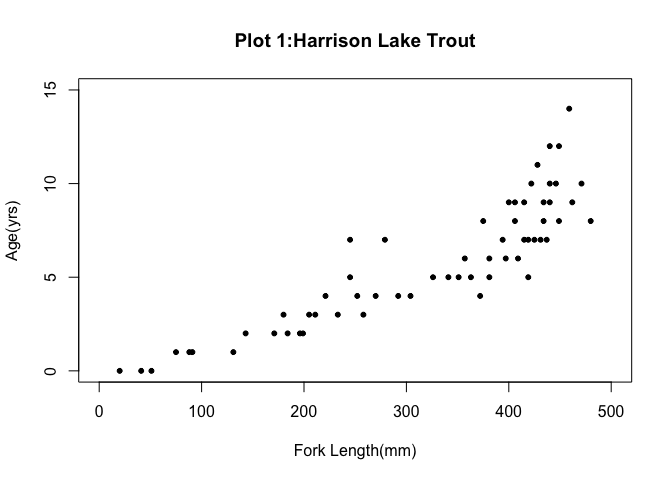
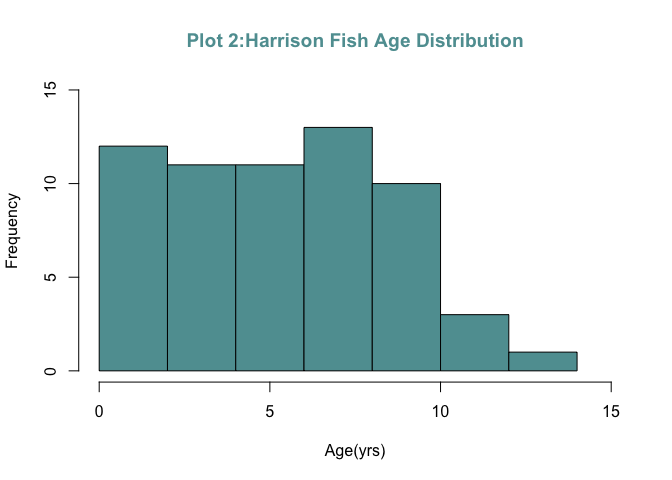
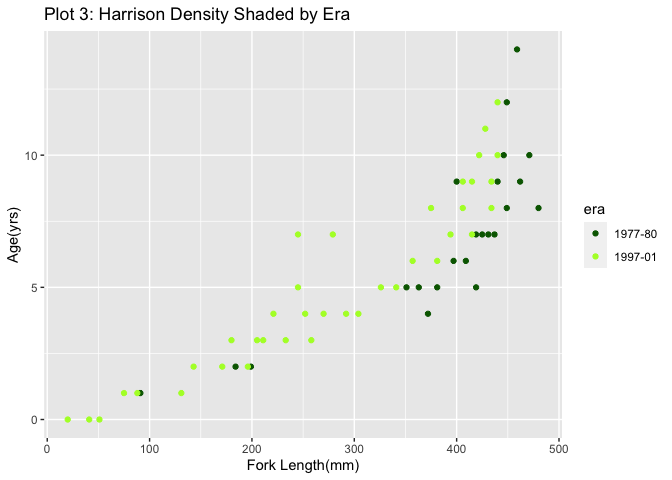
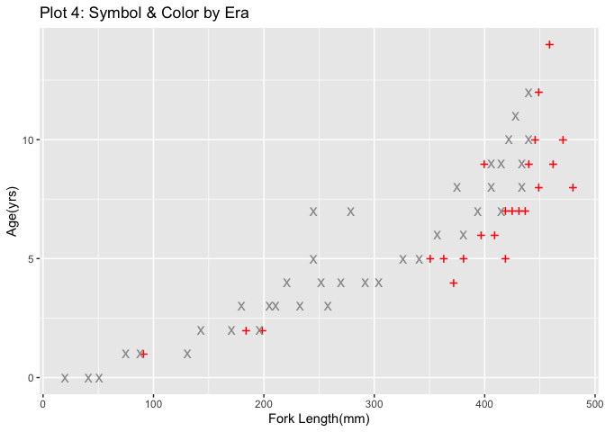
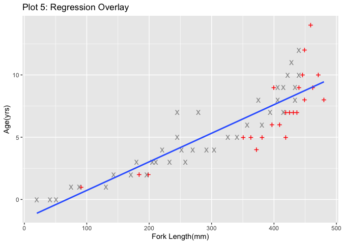
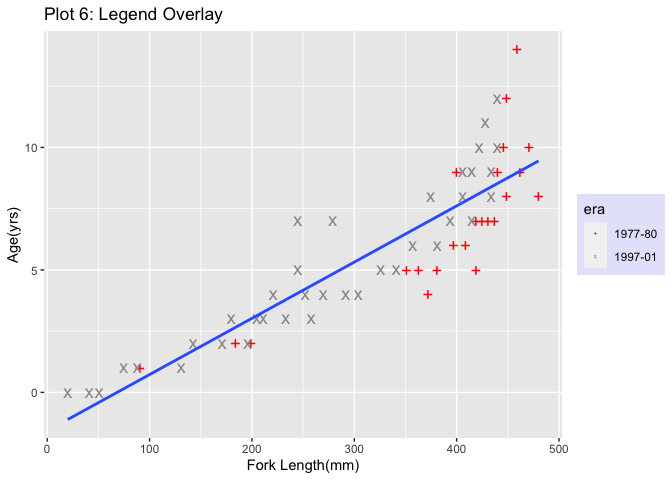
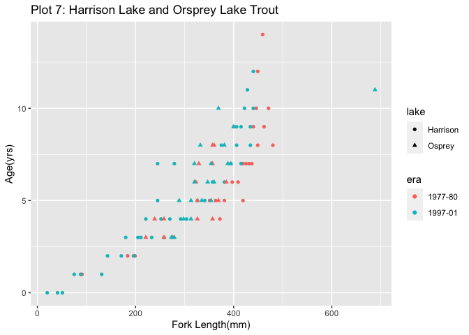
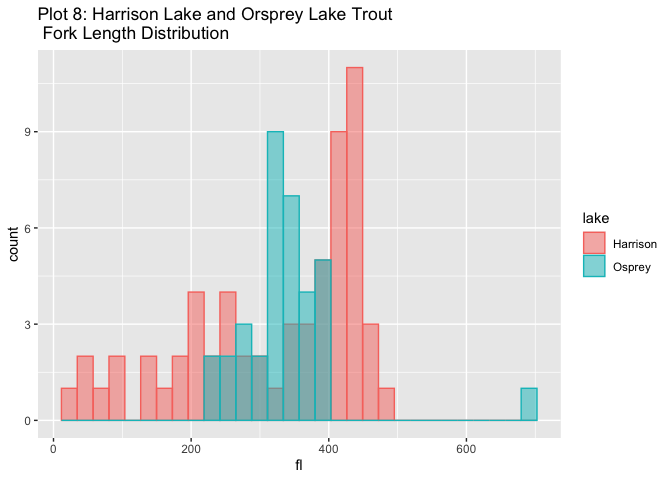

Plotting Basics
================
Yu-Wei Hsu

This project demonstrates the skills to process data, present the data
visually, and calculate basic; all with explanatory analysis.  
Expected learning outcomes:  
- Calculate basic descriptive statistics to describe a set of data  
- Create various types of graph based on data provided  
- Use R to visualize data  
- Explain the significance of calculate statistics and graphs

### Import Libraries

``` r
library(FSA)
```

    ## ## FSA v0.8.30. See citation('FSA') if used in publication.
    ## ## Run fishR() for related website and fishR('IFAR') for related book.

``` r
library(FSAdata)
```

    ## ## FSAdata v0.3.8. See ?FSAdata to find data for specific fisheries analyses.

``` r
library(magrittr)
library(dplyr)
```

    ## 
    ## Attaching package: 'dplyr'

    ## The following objects are masked from 'package:stats':
    ## 
    ##     filter, lag

    ## The following objects are masked from 'package:base':
    ## 
    ##     intersect, setdiff, setequal, union

``` r
library(plotrix)
library(ggplot2)
library(moments)
```

### Load Data

``` r
#display BullTroutRML2 dataset which is in FSA library
BullTroutRML2
```

    ##    age  fl     lake     era
    ## 1   14 459 Harrison 1977-80
    ## 2   12 449 Harrison 1977-80
    ## 3   10 471 Harrison 1977-80
    ## 4   10 446 Harrison 1977-80
    ## 5    9 400 Harrison 1977-80
    ## 6    9 440 Harrison 1977-80
    ## 7    9 462 Harrison 1977-80
    ## 8    8 480 Harrison 1977-80
    ## 9    8 449 Harrison 1977-80
    ## 10   7 437 Harrison 1977-80
    ## 11   7 431 Harrison 1977-80
    ## 12   7 425 Harrison 1977-80
    ## 13   7 419 Harrison 1977-80
    ## 14   6 409 Harrison 1977-80
    ## 15   6 397 Harrison 1977-80
    ## 16   5 419 Harrison 1977-80
    ## 17   5 381 Harrison 1977-80
    ## 18   5 363 Harrison 1977-80
    ## 19   5 351 Harrison 1977-80
    ## 20   4 372 Harrison 1977-80
    ## 21   2 199 Harrison 1977-80
    ## 22   2 184 Harrison 1977-80
    ## 23   1  91 Harrison 1977-80
    ## 24  12 440 Harrison 1997-01
    ## 25  11 428 Harrison 1997-01
    ## 26  10 440 Harrison 1997-01
    ## 27  10 422 Harrison 1997-01
    ## 28   9 434 Harrison 1997-01
    ## 29   9 415 Harrison 1997-01
    ## 30   9 406 Harrison 1997-01
    ## 31   8 434 Harrison 1997-01
    ## 32   8 406 Harrison 1997-01
    ## 33   8 375 Harrison 1997-01
    ## 34   7 415 Harrison 1997-01
    ## 35   7 394 Harrison 1997-01
    ## 36   6 381 Harrison 1997-01
    ## 37   6 357 Harrison 1997-01
    ## 38   5 341 Harrison 1997-01
    ## 39   5 326 Harrison 1997-01
    ## 40   4 304 Harrison 1997-01
    ## 41   4 292 Harrison 1997-01
    ## 42   4 270 Harrison 1997-01
    ## 43   4 252 Harrison 1997-01
    ## 44   4 221 Harrison 1997-01
    ## 45   3 258 Harrison 1997-01
    ## 46   3 233 Harrison 1997-01
    ## 47   3 211 Harrison 1997-01
    ## 48   3 205 Harrison 1997-01
    ## 49   3 180 Harrison 1997-01
    ## 50   2 196 Harrison 1997-01
    ## 51   2 171 Harrison 1997-01
    ## 52   2 143 Harrison 1997-01
    ## 53   1 131 Harrison 1997-01
    ## 54   1  88 Harrison 1997-01
    ## 55   1  75 Harrison 1997-01
    ## 56   0  51 Harrison 1997-01
    ## 57   0  41 Harrison 1997-01
    ## 58   0  20 Harrison 1997-01
    ## 59   7 245 Harrison 1997-01
    ## 60   7 279 Harrison 1997-01
    ## 61   5 245 Harrison 1997-01
    ## 62   8 360   Osprey 1977-80
    ## 63   8 357   Osprey 1977-80
    ## 64   7 357   Osprey 1977-80
    ## 65   7 329   Osprey 1977-80
    ## 66   6 385   Osprey 1977-80
    ## 67   6 323   Osprey 1977-80
    ## 68   5 369   Osprey 1977-80
    ## 69   5 326   Osprey 1977-80
    ## 70   4 357   Osprey 1977-80
    ## 71   4 326   Osprey 1977-80
    ## 72   4 258   Osprey 1977-80
    ## 73   4 239   Osprey 1977-80
    ## 74   3 221   Osprey 1977-80
    ## 75   3 258   Osprey 1977-80
    ## 76   3 276   Osprey 1977-80
    ## 77  11 688   Osprey 1997-01
    ## 78  10 369   Osprey 1997-01
    ## 79   9 400   Osprey 1997-01
    ## 80   8 381   Osprey 1997-01
    ## 81   8 332   Osprey 1997-01
    ## 82   7 394   Osprey 1997-01
    ## 83   7 388   Osprey 1997-01
    ## 84   7 354   Osprey 1997-01
    ## 85   7 320   Osprey 1997-01
    ## 86   6 320   Osprey 1997-01
    ## 87   6 347   Osprey 1997-01
    ## 88   6 360   Osprey 1997-01
    ## 89   5 354   Osprey 1997-01
    ## 90   5 335   Osprey 1997-01
    ## 91   5 313   Osprey 1997-01
    ## 92   5 289   Osprey 1997-01
    ## 93   4 313   Osprey 1997-01
    ## 94   4 298   Osprey 1997-01
    ## 95   3 279   Osprey 1997-01
    ## 96   3 273   Osprey 1997-01

#### Overview

``` r
headtail(BullTroutRML2,n=3) #3 records form top and bottom of BullTroutRML2
```

    ##    age  fl     lake     era
    ## 1   14 459 Harrison 1977-80
    ## 2   12 449 Harrison 1977-80
    ## 3   10 471 Harrison 1977-80
    ## 94   4 298   Osprey 1997-01
    ## 95   3 279   Osprey 1997-01
    ## 96   3 273   Osprey 1997-01

``` r
str(BullTroutRML2)
```

    ## 'data.frame':    96 obs. of  4 variables:
    ##  $ age : int  14 12 10 10 9 9 9 8 8 7 ...
    ##  $ fl  : int  459 449 471 446 400 440 462 480 449 437 ...
    ##  $ lake: Factor w/ 2 levels "Harrison","Osprey": 1 1 1 1 1 1 1 1 1 1 ...
    ##  $ era : Factor w/ 2 levels "1977-80","1997-01": 1 1 1 1 1 1 1 1 1 1 ...

``` r
summary(BullTroutRML2)
```

    ##       age               fl              lake         era    
    ##  Min.   : 0.000   Min.   : 20.0   Harrison:61   1977-80:38  
    ##  1st Qu.: 4.000   1st Qu.:258.0   Osprey  :35   1997-01:58  
    ##  Median : 6.000   Median :352.5                             
    ##  Mean   : 5.771   Mean   :326.1                             
    ##  3rd Qu.: 8.000   3rd Qu.:406.0                             
    ##  Max.   :14.000   Max.   :688.0

### EDA

#### Split Datasets

``` r
#assign new dataset with only Harrison in lake fields
HL <- filter(BullTroutRML2,lake =="Harrison")
#assign new dataset with only Osprey in lake fields
OL <- filter(BullTroutRML2,lake =="Osprey")

#compare datasets            
summary(HL)
```

    ##       age               fl            lake         era    
    ##  Min.   : 0.000   Min.   : 20   Harrison:61   1977-80:23  
    ##  1st Qu.: 3.000   1st Qu.:221   Osprey  : 0   1997-01:38  
    ##  Median : 6.000   Median :372                             
    ##  Mean   : 5.754   Mean   :319                             
    ##  3rd Qu.: 8.000   3rd Qu.:425                             
    ##  Max.   :14.000   Max.   :480

``` r
summary(OL)
```

    ##       age             fl              lake         era    
    ##  Min.   : 3.0   Min.   :221.0   Harrison: 0   1977-80:15  
    ##  1st Qu.: 4.0   1st Qu.:305.5   Osprey  :35   1997-01:20  
    ##  Median : 6.0   Median :332.0                             
    ##  Mean   : 5.8   Mean   :338.5                             
    ##  3rd Qu.: 7.0   3rd Qu.:360.0                             
    ##  Max.   :11.0   Max.   :688.0

-   The average and range of both age and fish length records are quite
    similar, however, the numbers of fish length in Osprey dataset are
    larger than Harrison dataset.

#### Harrison Lake Visualization

``` r
attach(HL)              #attach HL dataset
#scatter plot 
plot(age~fl,xlim=c(0,500),ylim=c(0,15),
     main = 'Plot 1:Harrison Lake Trout',
     xlab = 'Fork Length(mm)',ylab = 'Age(yrs)',
     pch=20)
```

<!-- -->

``` r
#ggplot(HL,aes(x=fl,y=age))+geom_point()+
#       labs(title='Plot 1: Harrison Lake Trout',
#       x='Fork Length(mm)',y = 'Age(yrs)' )
```

``` r
#histogram
hist(age,xlim=c(0,15),ylim=c(0,15),
     main = 'Plot 2:Harrison Fish Age Distribution',
     xlab = 'Age(yrs)',ylab = 'Frequency',
     col = 'cadetblue',col.main = 'cadetblue')
```

<!-- -->

``` r
#ggplot(HL,aes(x=age))+geom_histogram(fill = 'cadetblue')+
#      labs(title = 'Plot 2:Harrison Fish Age Distribution',
#           x = 'Age(yrs)',y = 'Frequency')
```

``` r
#showing different colors by era (ggplot2)
ggplot(HL,aes(x=fl,y=age,color = era))+geom_point()+
       labs(title='Plot 3: Harrison Density Shaded by Era',
       x='Fork Length(mm)',y = 'Age(yrs)' )+
       scale_color_manual(values=c('#006400','#ADFF2F'))
```

<!-- -->

``` r
pchs <- c('+','x')
cols <- c('red','gray60')
#scatter plot: change character and shape
#assgin p as graph name
p <- ggplot(HL,aes(x=fl,y=age))+
            geom_point(aes(shape=era,color=era,size=3))+
            labs(title='Plot 4: Symbol & Color by Era',
            x='Fork Length(mm)',y = 'Age(yrs)' )+
            scale_color_manual(values=cols)+
            scale_shape_manual(values=pchs)+
            theme(legend.position = 'none')            
p           #display plot
```

<!-- -->

``` r
#plot(age~fl,xlim=c(0,500),ylim=c(0,15),
#     main = 'Plot 4: Symbol & Color by Era',
#     xlab = 'Fork Length(mm)',ylab = 'Age(yrs)',
#     pch=pchs,col = cols)
```

``` r
#regression line with plot
#abline(lm(age~fl),col='blue')
p<-p+labs(title='Plot 5: Regression Overlay')+
     scale_shape_manual(values=pchs)+geom_smooth(method=lm,se=FALSE)
```

    ## Scale for 'shape' is already present. Adding another scale for 'shape', which
    ## will replace the existing scale.

``` r
p
```

    ## `geom_smooth()` using formula 'y ~ x'

<!-- -->

``` r
#legend with plot
#legend(x = 'topleft',legend = 'Regression Line')
p<-p+labs(title='Plot 6: Legend Overlay')+guides(size=FALSE)+
     theme(legend.position='right',
           legend.background = element_rect(fill = 'lavender'))
```

    ## Warning: `guides(<scale> = FALSE)` is deprecated. Please use `guides(<scale> =
    ## "none")` instead.

``` r
p
```

    ## `geom_smooth()` using formula 'y ~ x'

<!-- -->

``` r
detach(HL)            #datach HL dataset
```

-   The shape of distribution of fish age is skewed right, only few
    fishes observed are more than 10 years old. (Plot 2)
-   From the scatter plots showed below(Plot 3 & 4), they provide that
    the fork length has a great relationship with age, Bull Trout with
    longer length usually is elder. In addition, by different symbols
    and colors on the plots, they show that there are fewer smaller and
    younger fishes had been recorded in 1977 than 1997.

#### Compare Two Laske Observations

``` r
#compare Harrison and Osprey observations
BT2 <- ggplot(BullTroutRML2,aes(x=fl,y=age))+
       geom_point(aes(shape=lake,color=era))+
       labs(title='Plot 7: Harrison Lake and Orsprey Lake Trout',
       x='Fork Length(mm)',y = 'Age(yrs)' )
BT2
```

<!-- -->

``` r
BTL <- ggplot(BullTroutRML2,aes(x=fl,fill=lake,color=lake))+
       geom_histogram(position='identity',alpha=0.5)+
       labs(title='Plot 8: Harrison Lake and Orsprey Lake Trout\n Fork Length Distribution')
       theme(legend.position ='top')
```

    ## List of 1
    ##  $ legend.position: chr "top"
    ##  - attr(*, "class")= chr [1:2] "theme" "gg"
    ##  - attr(*, "complete")= logi FALSE
    ##  - attr(*, "validate")= logi TRUE

``` r
BTL
```

    ## `stat_bin()` using `bins = 30`. Pick better value with `binwidth`.

<!-- -->

-   In the plot 7, it shows details by using different symbols and
    colors. Two symbols spread average and represent two lakes data.
    However, there are fewer small and young Bull Trouts in 1977 dataset
    which may influenced by fish harvest activities or ecosystem
    environment in two time periods.
-   Besides, there is an outlier in Osprey lake dataset with over 600mm
    length, it makes the mean of Osprey dataset higher than median.
    (Plot 8)

### Conclusion

Key Findings:  
- Average life of Bull Trout is about 6 years old, and few trout can
live over 10 years.  
- Normal length of Bull Trout is around 330mm, but we have a record over
600mm, which is nearly twice than usual.  
- In 1997, we observer more variety of Bull Trout in Harrison Lake and
Osprey Lake, one possible reason could be people stopped overfishing to
maintain supply and demand in the future. However, we need more data and
further investigate to prove this assumption.
