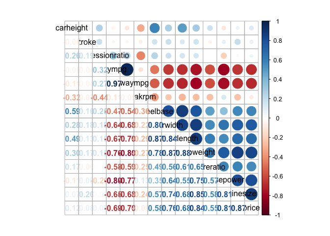
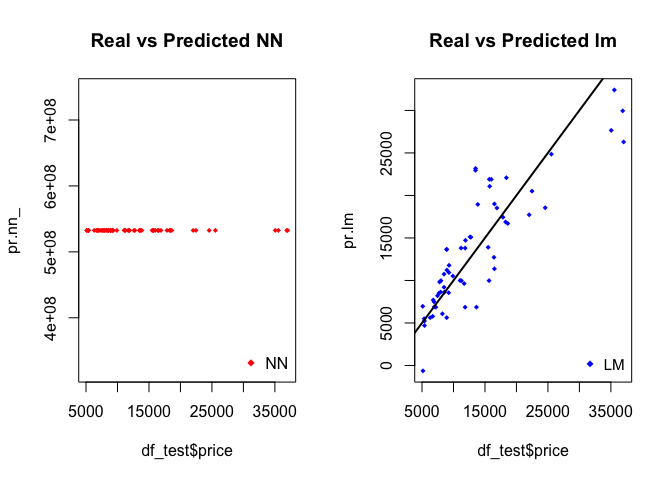

Car Price Dataset Analysis
================
Yu-Wei Hsu

This project is intended to explore the car price dataset, which is
obtained from Kaggle, with 205 observations and 26 attributes to
understand the relationship with the car price and other import features
.  
Expected learning outcomes:  
1. Utilize the “R” as a tool set for processing and analyzing basic
data  
2. Visualize data in a compelling way to enable data driven
storytelling.  
3. Implement machine learning algorithms such as Linear Regression,
Decision Tree, Random Forest, Gradient Boosting, and Neural Network
models.  
4. Supplementary models with data mining and optimization techniques
like dimension reduction.

### Set up environment

#### Import Libraries

``` r
library(FSA)
```

    ## ## FSA v0.8.30. See citation('FSA') if used in publication.
    ## ## Run fishR() for related website and fishR('IFAR') for related book.

``` r
library(tidyverse)
```

    ## ── Attaching packages ─────────────────────────────────────── tidyverse 1.3.0 ──

    ## ✓ ggplot2 3.3.5     ✓ purrr   0.3.4
    ## ✓ tibble  3.0.3     ✓ dplyr   1.0.2
    ## ✓ tidyr   1.1.2     ✓ stringr 1.4.0
    ## ✓ readr   1.3.1     ✓ forcats 0.5.0

    ## ── Conflicts ────────────────────────────────────────── tidyverse_conflicts() ──
    ## x dplyr::filter() masks stats::filter()
    ## x dplyr::lag()    masks stats::lag()

``` r
library(corrplot)
```

    ## corrplot 0.90 loaded

``` r
library(caret)
```

    ## Loading required package: lattice

    ## 
    ## Attaching package: 'caret'

    ## The following object is masked from 'package:purrr':
    ## 
    ##     lift

``` r
library(rsample)
library(gbm)
```

    ## Loaded gbm 2.1.8

``` r
library(randomForest)
```

    ## randomForest 4.6-14

    ## Type rfNews() to see new features/changes/bug fixes.

    ## 
    ## Attaching package: 'randomForest'

    ## The following object is masked from 'package:dplyr':
    ## 
    ##     combine

    ## The following object is masked from 'package:ggplot2':
    ## 
    ##     margin

``` r
library(rpart)
library(e1071) #svm
```

    ## 
    ## Attaching package: 'e1071'

    ## The following object is masked from 'package:rsample':
    ## 
    ##     permutations

``` r
library(xgboost)
```

    ## 
    ## Attaching package: 'xgboost'

    ## The following object is masked from 'package:dplyr':
    ## 
    ##     slice

``` r
library(neuralnet)
```

    ## 
    ## Attaching package: 'neuralnet'

    ## The following object is masked from 'package:dplyr':
    ## 
    ##     compute

#### Aaccess Data

``` r
setwd("~/Desktop/Github/R")
carprice <- read.csv("CarPrice.csv")
```

### EDA

#### Overview

``` r
headtail(carprice,3) # (FSA)
```

    ##     car_ID symboling                  CarName fueltype aspiration doornumber
    ## 1        1         3       alfa-romero giulia      gas        std        two
    ## 2        2         3      alfa-romero stelvio      gas        std        two
    ## 3        3         1 alfa-romero Quadrifoglio      gas        std        two
    ## 203    203        -1              volvo 244dl      gas        std       four
    ## 204    204        -1                volvo 246   diesel      turbo       four
    ## 205    205        -1              volvo 264gl      gas      turbo       four
    ##         carbody drivewheel enginelocation wheelbase carlength carwidth
    ## 1   convertible        rwd          front      88.6     168.8     64.1
    ## 2   convertible        rwd          front      88.6     168.8     64.1
    ## 3     hatchback        rwd          front      94.5     171.2     65.5
    ## 203       sedan        rwd          front     109.1     188.8     68.9
    ## 204       sedan        rwd          front     109.1     188.8     68.9
    ## 205       sedan        rwd          front     109.1     188.8     68.9
    ##     carheight curbweight enginetype cylindernumber enginesize fuelsystem
    ## 1        48.8       2548       dohc           four        130       mpfi
    ## 2        48.8       2548       dohc           four        130       mpfi
    ## 3        52.4       2823       ohcv            six        152       mpfi
    ## 203      55.5       3012       ohcv            six        173       mpfi
    ## 204      55.5       3217        ohc            six        145        idi
    ## 205      55.5       3062        ohc           four        141       mpfi
    ##     boreratio stroke compressionratio horsepower peakrpm citympg highwaympg
    ## 1        3.47   2.68              9.0        111    5000      21         27
    ## 2        3.47   2.68              9.0        111    5000      21         27
    ## 3        2.68   3.47              9.0        154    5000      19         26
    ## 203      3.58   2.87              8.8        134    5500      18         23
    ## 204      3.01   3.40             23.0        106    4800      26         27
    ## 205      3.78   3.15              9.5        114    5400      19         25
    ##     price
    ## 1   13495
    ## 2   16500
    ## 3   16500
    ## 203 21485
    ## 204 22470
    ## 205 22625

``` r
str(carprice)
```

    ## 'data.frame':    205 obs. of  26 variables:
    ##  $ car_ID          : int  1 2 3 4 5 6 7 8 9 10 ...
    ##  $ symboling       : int  3 3 1 2 2 2 1 1 1 0 ...
    ##  $ CarName         : chr  "alfa-romero giulia" "alfa-romero stelvio" "alfa-romero Quadrifoglio" "audi 100 ls" ...
    ##  $ fueltype        : chr  "gas" "gas" "gas" "gas" ...
    ##  $ aspiration      : chr  "std" "std" "std" "std" ...
    ##  $ doornumber      : chr  "two" "two" "two" "four" ...
    ##  $ carbody         : chr  "convertible" "convertible" "hatchback" "sedan" ...
    ##  $ drivewheel      : chr  "rwd" "rwd" "rwd" "fwd" ...
    ##  $ enginelocation  : chr  "front" "front" "front" "front" ...
    ##  $ wheelbase       : num  88.6 88.6 94.5 99.8 99.4 ...
    ##  $ carlength       : num  169 169 171 177 177 ...
    ##  $ carwidth        : num  64.1 64.1 65.5 66.2 66.4 66.3 71.4 71.4 71.4 67.9 ...
    ##  $ carheight       : num  48.8 48.8 52.4 54.3 54.3 53.1 55.7 55.7 55.9 52 ...
    ##  $ curbweight      : int  2548 2548 2823 2337 2824 2507 2844 2954 3086 3053 ...
    ##  $ enginetype      : chr  "dohc" "dohc" "ohcv" "ohc" ...
    ##  $ cylindernumber  : chr  "four" "four" "six" "four" ...
    ##  $ enginesize      : int  130 130 152 109 136 136 136 136 131 131 ...
    ##  $ fuelsystem      : chr  "mpfi" "mpfi" "mpfi" "mpfi" ...
    ##  $ boreratio       : num  3.47 3.47 2.68 3.19 3.19 3.19 3.19 3.19 3.13 3.13 ...
    ##  $ stroke          : num  2.68 2.68 3.47 3.4 3.4 3.4 3.4 3.4 3.4 3.4 ...
    ##  $ compressionratio: num  9 9 9 10 8 8.5 8.5 8.5 8.3 7 ...
    ##  $ horsepower      : int  111 111 154 102 115 110 110 110 140 160 ...
    ##  $ peakrpm         : int  5000 5000 5000 5500 5500 5500 5500 5500 5500 5500 ...
    ##  $ citympg         : int  21 21 19 24 18 19 19 19 17 16 ...
    ##  $ highwaympg      : int  27 27 26 30 22 25 25 25 20 22 ...
    ##  $ price           : num  13495 16500 16500 13950 17450 ...

``` r
summary(carprice)
```

    ##      car_ID      symboling         CarName            fueltype        
    ##  Min.   :  1   Min.   :-2.0000   Length:205         Length:205        
    ##  1st Qu.: 52   1st Qu.: 0.0000   Class :character   Class :character  
    ##  Median :103   Median : 1.0000   Mode  :character   Mode  :character  
    ##  Mean   :103   Mean   : 0.8341                                        
    ##  3rd Qu.:154   3rd Qu.: 2.0000                                        
    ##  Max.   :205   Max.   : 3.0000                                        
    ##   aspiration         doornumber          carbody           drivewheel       
    ##  Length:205         Length:205         Length:205         Length:205        
    ##  Class :character   Class :character   Class :character   Class :character  
    ##  Mode  :character   Mode  :character   Mode  :character   Mode  :character  
    ##                                                                             
    ##                                                                             
    ##                                                                             
    ##  enginelocation       wheelbase        carlength        carwidth    
    ##  Length:205         Min.   : 86.60   Min.   :141.1   Min.   :60.30  
    ##  Class :character   1st Qu.: 94.50   1st Qu.:166.3   1st Qu.:64.10  
    ##  Mode  :character   Median : 97.00   Median :173.2   Median :65.50  
    ##                     Mean   : 98.76   Mean   :174.0   Mean   :65.91  
    ##                     3rd Qu.:102.40   3rd Qu.:183.1   3rd Qu.:66.90  
    ##                     Max.   :120.90   Max.   :208.1   Max.   :72.30  
    ##    carheight       curbweight    enginetype        cylindernumber    
    ##  Min.   :47.80   Min.   :1488   Length:205         Length:205        
    ##  1st Qu.:52.00   1st Qu.:2145   Class :character   Class :character  
    ##  Median :54.10   Median :2414   Mode  :character   Mode  :character  
    ##  Mean   :53.72   Mean   :2556                                        
    ##  3rd Qu.:55.50   3rd Qu.:2935                                        
    ##  Max.   :59.80   Max.   :4066                                        
    ##    enginesize     fuelsystem          boreratio        stroke     
    ##  Min.   : 61.0   Length:205         Min.   :2.54   Min.   :2.070  
    ##  1st Qu.: 97.0   Class :character   1st Qu.:3.15   1st Qu.:3.110  
    ##  Median :120.0   Mode  :character   Median :3.31   Median :3.290  
    ##  Mean   :126.9                      Mean   :3.33   Mean   :3.255  
    ##  3rd Qu.:141.0                      3rd Qu.:3.58   3rd Qu.:3.410  
    ##  Max.   :326.0                      Max.   :3.94   Max.   :4.170  
    ##  compressionratio   horsepower       peakrpm        citympg     
    ##  Min.   : 7.00    Min.   : 48.0   Min.   :4150   Min.   :13.00  
    ##  1st Qu.: 8.60    1st Qu.: 70.0   1st Qu.:4800   1st Qu.:19.00  
    ##  Median : 9.00    Median : 95.0   Median :5200   Median :24.00  
    ##  Mean   :10.14    Mean   :104.1   Mean   :5125   Mean   :25.22  
    ##  3rd Qu.: 9.40    3rd Qu.:116.0   3rd Qu.:5500   3rd Qu.:30.00  
    ##  Max.   :23.00    Max.   :288.0   Max.   :6600   Max.   :49.00  
    ##    highwaympg        price      
    ##  Min.   :16.00   Min.   : 5118  
    ##  1st Qu.:25.00   1st Qu.: 7788  
    ##  Median :30.00   Median :10295  
    ##  Mean   :30.75   Mean   :13277  
    ##  3rd Qu.:34.00   3rd Qu.:16503  
    ##  Max.   :54.00   Max.   :45400

``` r
# check missing value
sprintf("%d missing value in the data frame.",sum(is.na(carprice)))
```

    ## [1] "0 missing value in the data frame."

#### Data Cleaning

``` r
df <- carprice # copy the data frame 

# convert symboling as character data type and remove car_ID
df <- df %>% 
  mutate(symboling = as.character((symboling))) %>% 
  select(-car_ID) 

# see unique values in CarName column
unique(df$CarName)
```

    ##   [1] "alfa-romero giulia"              "alfa-romero stelvio"            
    ##   [3] "alfa-romero Quadrifoglio"        "audi 100 ls"                    
    ##   [5] "audi 100ls"                      "audi fox"                       
    ##   [7] "audi 5000"                       "audi 4000"                      
    ##   [9] "audi 5000s (diesel)"             "bmw 320i"                       
    ##  [11] "bmw x1"                          "bmw x3"                         
    ##  [13] "bmw z4"                          "bmw x4"                         
    ##  [15] "bmw x5"                          "chevrolet impala"               
    ##  [17] "chevrolet monte carlo"           "chevrolet vega 2300"            
    ##  [19] "dodge rampage"                   "dodge challenger se"            
    ##  [21] "dodge d200"                      "dodge monaco (sw)"              
    ##  [23] "dodge colt hardtop"              "dodge colt (sw)"                
    ##  [25] "dodge coronet custom"            "dodge dart custom"              
    ##  [27] "dodge coronet custom (sw)"       "honda civic"                    
    ##  [29] "honda civic cvcc"                "honda accord cvcc"              
    ##  [31] "honda accord lx"                 "honda civic 1500 gl"            
    ##  [33] "honda accord"                    "honda civic 1300"               
    ##  [35] "honda prelude"                   "honda civic (auto)"             
    ##  [37] "isuzu MU-X"                      "isuzu D-Max "                   
    ##  [39] "isuzu D-Max V-Cross"             "jaguar xj"                      
    ##  [41] "jaguar xf"                       "jaguar xk"                      
    ##  [43] "maxda rx3"                       "maxda glc deluxe"               
    ##  [45] "mazda rx2 coupe"                 "mazda rx-4"                     
    ##  [47] "mazda glc deluxe"                "mazda 626"                      
    ##  [49] "mazda glc"                       "mazda rx-7 gs"                  
    ##  [51] "mazda glc 4"                     "mazda glc custom l"             
    ##  [53] "mazda glc custom"                "buick electra 225 custom"       
    ##  [55] "buick century luxus (sw)"        "buick century"                  
    ##  [57] "buick skyhawk"                   "buick opel isuzu deluxe"        
    ##  [59] "buick skylark"                   "buick century special"          
    ##  [61] "buick regal sport coupe (turbo)" "mercury cougar"                 
    ##  [63] "mitsubishi mirage"               "mitsubishi lancer"              
    ##  [65] "mitsubishi outlander"            "mitsubishi g4"                  
    ##  [67] "mitsubishi mirage g4"            "mitsubishi montero"             
    ##  [69] "mitsubishi pajero"               "Nissan versa"                   
    ##  [71] "nissan gt-r"                     "nissan rogue"                   
    ##  [73] "nissan latio"                    "nissan titan"                   
    ##  [75] "nissan leaf"                     "nissan juke"                    
    ##  [77] "nissan note"                     "nissan clipper"                 
    ##  [79] "nissan nv200"                    "nissan dayz"                    
    ##  [81] "nissan fuga"                     "nissan otti"                    
    ##  [83] "nissan teana"                    "nissan kicks"                   
    ##  [85] "peugeot 504"                     "peugeot 304"                    
    ##  [87] "peugeot 504 (sw)"                "peugeot 604sl"                  
    ##  [89] "peugeot 505s turbo diesel"       "plymouth fury iii"              
    ##  [91] "plymouth cricket"                "plymouth satellite custom (sw)" 
    ##  [93] "plymouth fury gran sedan"        "plymouth valiant"               
    ##  [95] "plymouth duster"                 "porsche macan"                  
    ##  [97] "porcshce panamera"               "porsche cayenne"                
    ##  [99] "porsche boxter"                  "renault 12tl"                   
    ## [101] "renault 5 gtl"                   "saab 99e"                       
    ## [103] "saab 99le"                       "saab 99gle"                     
    ## [105] "subaru"                          "subaru dl"                      
    ## [107] "subaru brz"                      "subaru baja"                    
    ## [109] "subaru r1"                       "subaru r2"                      
    ## [111] "subaru trezia"                   "subaru tribeca"                 
    ## [113] "toyota corona mark ii"           "toyota corona"                  
    ## [115] "toyota corolla 1200"             "toyota corona hardtop"          
    ## [117] "toyota corolla 1600 (sw)"        "toyota carina"                  
    ## [119] "toyota mark ii"                  "toyota corolla"                 
    ## [121] "toyota corolla liftback"         "toyota celica gt liftback"      
    ## [123] "toyota corolla tercel"           "toyota corona liftback"         
    ## [125] "toyota starlet"                  "toyota tercel"                  
    ## [127] "toyota cressida"                 "toyota celica gt"               
    ## [129] "toyouta tercel"                  "vokswagen rabbit"               
    ## [131] "volkswagen 1131 deluxe sedan"    "volkswagen model 111"           
    ## [133] "volkswagen type 3"               "volkswagen 411 (sw)"            
    ## [135] "volkswagen super beetle"         "volkswagen dasher"              
    ## [137] "vw dasher"                       "vw rabbit"                      
    ## [139] "volkswagen rabbit"               "volkswagen rabbit custom"       
    ## [141] "volvo 145e (sw)"                 "volvo 144ea"                    
    ## [143] "volvo 244dl"                     "volvo 245"                      
    ## [145] "volvo 264gl"                     "volvo diesel"                   
    ## [147] "volvo 246"

``` r
# keep only car brand in CarName and store in the new column carbrand
df <- df %>%
  separate(CarName,'carbrand', remove=TRUE, sep = " ")
```

    ## Warning: Expected 1 pieces. Additional pieces discarded in 203 rows [1, 2, 3, 4,
    ## 5, 6, 7, 8, 9, 10, 11, 12, 13, 14, 15, 16, 17, 18, 19, 20, ...].

``` r
# Correct value dictionary
dic <- c("alfa-romero" = "alfa-romeo", "maxda" = "mazda", "nissan" = "Nissan",
         "porcshce" = "porsche", "toyouta" = "toyota", "vokswagen" = "volkswagen",
         "vw" = "volkswagen")
df <- df %>%
  mutate(carbrand = recode_factor(carbrand, !!!dic)) # (dplyr)
```

We find there are some typos and duplicated values in the CarName by
checking the unique value in the column unique(file\_name$column\_name).
Therefore, we store the values in a new column named carbrand, split by
the white space and only kept the brand name of the car. Then fix the
carbrand by replacing duplicated and typo values and converting to
character data type from factor.

``` r
# split numerical and categorical columns
num_col <- select_if(df,is.numeric) # (dplyr)
cat_col <- df[, sapply(df, class) == 'character']
```

#### Visualization

``` r
# heatmap 
corr <- cor(num_col)
round(corr,2)
```

    ##                  wheelbase carlength carwidth carheight curbweight enginesize
    ## wheelbase             1.00      0.87     0.80      0.59       0.78       0.57
    ## carlength             0.87      1.00     0.84      0.49       0.88       0.68
    ## carwidth              0.80      0.84     1.00      0.28       0.87       0.74
    ## carheight             0.59      0.49     0.28      1.00       0.30       0.07
    ## curbweight            0.78      0.88     0.87      0.30       1.00       0.85
    ## enginesize            0.57      0.68     0.74      0.07       0.85       1.00
    ## boreratio             0.49      0.61     0.56      0.17       0.65       0.58
    ## stroke                0.16      0.13     0.18     -0.06       0.17       0.20
    ## compressionratio      0.25      0.16     0.18      0.26       0.15       0.03
    ## horsepower            0.35      0.55     0.64     -0.11       0.75       0.81
    ## peakrpm              -0.36     -0.29    -0.22     -0.32      -0.27      -0.24
    ## citympg              -0.47     -0.67    -0.64     -0.05      -0.76      -0.65
    ## highwaympg           -0.54     -0.70    -0.68     -0.11      -0.80      -0.68
    ## price                 0.58      0.68     0.76      0.12       0.84       0.87
    ##                  boreratio stroke compressionratio horsepower peakrpm citympg
    ## wheelbase             0.49   0.16             0.25       0.35   -0.36   -0.47
    ## carlength             0.61   0.13             0.16       0.55   -0.29   -0.67
    ## carwidth              0.56   0.18             0.18       0.64   -0.22   -0.64
    ## carheight             0.17  -0.06             0.26      -0.11   -0.32   -0.05
    ## curbweight            0.65   0.17             0.15       0.75   -0.27   -0.76
    ## enginesize            0.58   0.20             0.03       0.81   -0.24   -0.65
    ## boreratio             1.00  -0.06             0.01       0.57   -0.25   -0.58
    ## stroke               -0.06   1.00             0.19       0.08   -0.07   -0.04
    ## compressionratio      0.01   0.19             1.00      -0.20   -0.44    0.32
    ## horsepower            0.57   0.08            -0.20       1.00    0.13   -0.80
    ## peakrpm              -0.25  -0.07            -0.44       0.13    1.00   -0.11
    ## citympg              -0.58  -0.04             0.32      -0.80   -0.11    1.00
    ## highwaympg           -0.59  -0.04             0.27      -0.77   -0.05    0.97
    ## price                 0.55   0.08             0.07       0.81   -0.09   -0.69
    ##                  highwaympg price
    ## wheelbase             -0.54  0.58
    ## carlength             -0.70  0.68
    ## carwidth              -0.68  0.76
    ## carheight             -0.11  0.12
    ## curbweight            -0.80  0.84
    ## enginesize            -0.68  0.87
    ## boreratio             -0.59  0.55
    ## stroke                -0.04  0.08
    ## compressionratio       0.27  0.07
    ## horsepower            -0.77  0.81
    ## peakrpm               -0.05 -0.09
    ## citympg                0.97 -0.69
    ## highwaympg             1.00 -0.70
    ## price                 -0.70  1.00

``` r
corrplot.mixed(corr, order = 'hclust',tl.col = "black", tl.srt = 45)
```

<!-- -->

``` r
# print scatter plots 
ggplot(df,aes(x = horsepower,y = price,color = carbrand))+
  geom_point()+ggtitle('Scatter plot: Horse power vs Price')
```

<!-- -->

``` r
ggplot(df, aes(x=carbody, y=price,color=carbody)) + 
  geom_boxplot()+ggtitle('Boxplot: Carbody vs Price')
```

<!-- -->

``` r
ggplot(df, aes(x=drivewheel, y=price,color=drivewheel)) + 
  geom_boxplot(notch = TRUE)+ggtitle('Boxplot: Drivewheel vs Price')
```

    ## notch went outside hinges. Try setting notch=FALSE.

<!-- -->

### Preprocessing

``` r
num_col_t <- num_col %>% select(-price)
df_m <- df %>%
  mutate_at(colnames(num_col_t),scale)
df_m <- df %>%
  mutate_at(colnames(cat_col),factor)
num_df <- num_col %>%
  mutate_at(colnames(num_col_t),scale)
```

``` r
# split test train data
set.seed(123)
df_split <- initial_split(num_df, prop = .7)
df_train <- training(df_split)
df_test  <- testing(df_split)
```

### Modeling

#### Linear Regression

``` r
mlr <- lm(price ~ ., data = df_train)
anova(mlr)
```

    ## Analysis of Variance Table
    ## 
    ## Response: price
    ##                   Df     Sum Sq    Mean Sq  F value    Pr(>F)    
    ## wheelbase          1 3672845292 3672845292 427.4419 < 2.2e-16 ***
    ## carlength          1 1104104141 1104104141 128.4945 < 2.2e-16 ***
    ## carwidth           1  994181552  994181552 115.7018 < 2.2e-16 ***
    ## carheight          1  150624317  150624317  17.5295 5.201e-05 ***
    ## curbweight         1 1079981824 1079981824 125.6871 < 2.2e-16 ***
    ## enginesize         1  900018406  900018406 104.7432 < 2.2e-16 ***
    ## boreratio          1    5943585    5943585   0.6917   0.40712    
    ## stroke             1   51252867   51252867   5.9648   0.01595 *  
    ## compressionratio   1     536826     536826   0.0625   0.80302    
    ## horsepower         1  191468418  191468418  22.2829 6.037e-06 ***
    ## peakrpm            1   52345402   52345402   6.0919   0.01489 *  
    ## citympg            1   13509421   13509421   1.5722   0.21215    
    ## highwaympg         1   14110802   14110802   1.6422   0.20232    
    ## Residuals        129 1108447887    8592619                       
    ## ---
    ## Signif. codes:  0 '***' 0.001 '**' 0.01 '*' 0.05 '.' 0.1 ' ' 1

``` r
summary(mlr)
```

    ## 
    ## Call:
    ## lm(formula = price ~ ., data = df_train)
    ## 
    ## Residuals:
    ##     Min      1Q  Median      3Q     Max 
    ## -9637.3 -1395.6  -156.2  1106.4 13749.0 
    ## 
    ## Coefficients:
    ##                  Estimate Std. Error t value Pr(>|t|)    
    ## (Intercept)       13271.8      249.7  53.144  < 2e-16 ***
    ## wheelbase          1179.2      713.1   1.653  0.10067    
    ## carlength          -779.7      749.3  -1.040  0.30007    
    ## carwidth            358.9      598.3   0.600  0.54967    
    ## carheight           757.0      385.8   1.962  0.05188 .  
    ## curbweight          511.9      929.4   0.551  0.58275    
    ## enginesize         5024.0      617.7   8.134    3e-13 ***
    ## boreratio          -542.6      385.1  -1.409  0.16128    
    ## stroke             -608.0      268.4  -2.265  0.02519 *  
    ## compressionratio   1100.6      360.6   3.052  0.00276 ** 
    ## horsepower         1675.9      742.3   2.258  0.02564 *  
    ## peakrpm             828.6      335.5   2.470  0.01482 *  
    ## citympg           -2359.8     1376.8  -1.714  0.08893 .  
    ## highwaympg         1648.1     1286.1   1.281  0.20232    
    ## ---
    ## Signif. codes:  0 '***' 0.001 '**' 0.01 '*' 0.05 '.' 0.1 ' ' 1
    ## 
    ## Residual standard error: 2931 on 129 degrees of freedom
    ## Multiple R-squared:  0.8813, Adjusted R-squared:  0.8694 
    ## F-statistic: 73.69 on 13 and 129 DF,  p-value: < 2.2e-16

``` r
mean(mlr$residuals^2)
```

    ## [1] 7751384

``` r
pr.lm <- predict(mlr,df_test)
MSE.lm <- sum((pr.lm - df_test$price)^2)/nrow(df_test)
```

``` r
# optimization for linear regression
mlrf <- step(mlr,direction = 'forward')
```

    ## Start:  AIC=2296.46
    ## price ~ wheelbase + carlength + carwidth + carheight + curbweight + 
    ##     enginesize + boreratio + stroke + compressionratio + horsepower + 
    ##     peakrpm + citympg + highwaympg

``` r
summary(mlrf)
```

    ## 
    ## Call:
    ## lm(formula = price ~ wheelbase + carlength + carwidth + carheight + 
    ##     curbweight + enginesize + boreratio + stroke + compressionratio + 
    ##     horsepower + peakrpm + citympg + highwaympg, data = df_train)
    ## 
    ## Residuals:
    ##     Min      1Q  Median      3Q     Max 
    ## -9637.3 -1395.6  -156.2  1106.4 13749.0 
    ## 
    ## Coefficients:
    ##                  Estimate Std. Error t value Pr(>|t|)    
    ## (Intercept)       13271.8      249.7  53.144  < 2e-16 ***
    ## wheelbase          1179.2      713.1   1.653  0.10067    
    ## carlength          -779.7      749.3  -1.040  0.30007    
    ## carwidth            358.9      598.3   0.600  0.54967    
    ## carheight           757.0      385.8   1.962  0.05188 .  
    ## curbweight          511.9      929.4   0.551  0.58275    
    ## enginesize         5024.0      617.7   8.134    3e-13 ***
    ## boreratio          -542.6      385.1  -1.409  0.16128    
    ## stroke             -608.0      268.4  -2.265  0.02519 *  
    ## compressionratio   1100.6      360.6   3.052  0.00276 ** 
    ## horsepower         1675.9      742.3   2.258  0.02564 *  
    ## peakrpm             828.6      335.5   2.470  0.01482 *  
    ## citympg           -2359.8     1376.8  -1.714  0.08893 .  
    ## highwaympg         1648.1     1286.1   1.281  0.20232    
    ## ---
    ## Signif. codes:  0 '***' 0.001 '**' 0.01 '*' 0.05 '.' 0.1 ' ' 1
    ## 
    ## Residual standard error: 2931 on 129 degrees of freedom
    ## Multiple R-squared:  0.8813, Adjusted R-squared:  0.8694 
    ## F-statistic: 73.69 on 13 and 129 DF,  p-value: < 2.2e-16

``` r
mlrb <- step(mlr,direction = 'backward')
```

    ## Start:  AIC=2296.46
    ## price ~ wheelbase + carlength + carwidth + carheight + curbweight + 
    ##     enginesize + boreratio + stroke + compressionratio + horsepower + 
    ##     peakrpm + citympg + highwaympg
    ## 
    ##                    Df Sum of Sq        RSS    AIC
    ## - curbweight        1   2606496 1111054383 2294.8
    ## - carwidth          1   3091646 1111539534 2294.9
    ## - carlength         1   9302183 1117750070 2295.7
    ## - highwaympg        1  14110802 1122558689 2296.3
    ## <none>                          1108447887 2296.5
    ## - boreratio         1  17055758 1125503645 2296.7
    ## - wheelbase         1  23491919 1131939806 2297.5
    ## - citympg           1  25243243 1133691130 2297.7
    ## - carheight         1  33085638 1141533525 2298.7
    ## - horsepower        1  43801070 1152248957 2300.0
    ## - stroke            1  44073586 1152521473 2300.0
    ## - peakrpm           1  52417070 1160864957 2301.1
    ## - compressionratio  1  80060032 1188507920 2304.4
    ## - enginesize        1 568477623 1676925510 2353.7
    ## 
    ## Step:  AIC=2294.8
    ## price ~ wheelbase + carlength + carwidth + carheight + enginesize + 
    ##     boreratio + stroke + compressionratio + horsepower + peakrpm + 
    ##     citympg + highwaympg
    ## 
    ##                    Df Sum of Sq        RSS    AIC
    ## - carwidth          1   3779480 1114833863 2293.3
    ## - carlength         1   7514097 1118568480 2293.8
    ## - highwaympg        1  12458042 1123512425 2294.4
    ## <none>                          1111054383 2294.8
    ## - boreratio         1  16440832 1127495215 2294.9
    ## - citympg           1  25702773 1136757156 2296.1
    ## - wheelbase         1  27248431 1138302814 2296.3
    ## - carheight         1  35267907 1146322290 2297.3
    ## - stroke            1  43795836 1154850219 2298.3
    ## - peakrpm           1  50129739 1161184122 2299.1
    ## - horsepower        1  53333070 1164387453 2299.5
    ## - compressionratio  1 109429503 1220483886 2306.2
    ## - enginesize        1 634105670 1745160054 2357.4
    ## 
    ## Step:  AIC=2293.29
    ## price ~ wheelbase + carlength + carheight + enginesize + boreratio + 
    ##     stroke + compressionratio + horsepower + peakrpm + citympg + 
    ##     highwaympg
    ## 
    ##                    Df Sum of Sq        RSS    AIC
    ## - carlength         1   5786888 1120620750 2292.0
    ## - highwaympg        1  12862928 1127696791 2292.9
    ## <none>                          1114833863 2293.3
    ## - boreratio         1  19809125 1134642988 2293.8
    ## - citympg           1  26379948 1141213811 2294.6
    ## - carheight         1  32541824 1147375687 2295.4
    ## - stroke            1  42568108 1157401971 2296.6
    ## - wheelbase         1  47749876 1162583738 2297.3
    ## - peakrpm           1  48593287 1163427149 2297.4
    ## - horsepower        1  73090748 1187924611 2300.4
    ## - compressionratio  1 122774481 1237608344 2306.2
    ## - enginesize        1 630929534 1745763397 2355.4
    ## 
    ## Step:  AIC=2292.03
    ## price ~ wheelbase + carheight + enginesize + boreratio + stroke + 
    ##     compressionratio + horsepower + peakrpm + citympg + highwaympg
    ## 
    ##                    Df Sum of Sq        RSS    AIC
    ## - highwaympg        1  10640369 1131261119 2291.4
    ## <none>                          1120620750 2292.0
    ## - citympg           1  21589813 1142210563 2292.8
    ## - boreratio         1  22288523 1142909273 2292.8
    ## - carheight         1  28079472 1148700223 2293.6
    ## - stroke            1  41871279 1162492029 2295.3
    ## - peakrpm           1  48474293 1169095043 2296.1
    ## - wheelbase         1  51197533 1171818283 2296.4
    ## - horsepower        1  71540094 1192160845 2298.9
    ## - compressionratio  1 116988691 1237609441 2304.2
    ## - enginesize        1 625177189 1745797939 2353.4
    ## 
    ## Step:  AIC=2291.38
    ## price ~ wheelbase + carheight + enginesize + boreratio + stroke + 
    ##     compressionratio + horsepower + peakrpm + citympg
    ## 
    ##                    Df Sum of Sq        RSS    AIC
    ## <none>                          1131261119 2291.4
    ## - citympg           1  16580392 1147841511 2291.5
    ## - boreratio         1  23015044 1154276164 2292.3
    ## - carheight         1  26837466 1158098586 2292.7
    ## - stroke            1  43149468 1174410587 2294.7
    ## - peakrpm           1  43630661 1174891780 2294.8
    ## - wheelbase         1  44597578 1175858697 2294.9
    ## - horsepower        1  87717825 1218978944 2300.1
    ## - compressionratio  1 114677232 1245938351 2303.2
    ## - enginesize        1 621134589 1752395709 2352.0

``` r
summary(mlrb)
```

    ## 
    ## Call:
    ## lm(formula = price ~ wheelbase + carheight + enginesize + boreratio + 
    ##     stroke + compressionratio + horsepower + peakrpm + citympg, 
    ##     data = df_train)
    ## 
    ## Residuals:
    ##      Min       1Q   Median       3Q      Max 
    ## -10070.3  -1558.3   -130.9   1086.1  13516.5 
    ## 
    ## Coefficients:
    ##                  Estimate Std. Error t value Pr(>|t|)    
    ## (Intercept)       13285.9      246.8  53.834  < 2e-16 ***
    ## wheelbase          1030.0      449.8   2.290 0.023607 *  
    ## carheight           652.5      367.3   1.776 0.077971 .  
    ## enginesize         4894.2      572.7   8.545 2.63e-14 ***
    ## boreratio          -616.9      375.0  -1.645 0.102343    
    ## stroke             -600.2      266.5  -2.252 0.025940 *  
    ## compressionratio   1153.3      314.1   3.672 0.000348 ***
    ## horsepower         2088.1      650.2   3.211 0.001657 ** 
    ## peakrpm             740.5      327.0   2.265 0.025139 *  
    ## citympg            -752.9      539.3  -1.396 0.164986    
    ## ---
    ## Signif. codes:  0 '***' 0.001 '**' 0.01 '*' 0.05 '.' 0.1 ' ' 1
    ## 
    ## Residual standard error: 2916 on 133 degrees of freedom
    ## Multiple R-squared:  0.8789, Adjusted R-squared:  0.8707 
    ## F-statistic: 107.2 on 9 and 133 DF,  p-value: < 2.2e-16

#### Decision Tree

``` r
dt <- rpart(price ~ ., method = "anova", data = df_train)
print(dt)
```

    ## n= 143 
    ## 
    ## node), split, n, deviance, yval
    ##       * denotes terminal node
    ## 
    ##  1) root 143 9339371000 13220.310  
    ##    2) enginesize< 1.322986 130 2611626000 11105.040  
    ##      4) curbweight< 0.02964228 89  418740500  8586.073  
    ##        8) curbweight< -0.5071555 56   72993230  7395.205 *
    ##        9) curbweight>=-0.5071555 33  131561300 10606.940 *
    ##      5) curbweight>=0.02964228 41  402299400 16573.050  
    ##       10) carwidth< 1.254983 34  257596900 15852.650 *
    ##       11) carwidth>=1.254983 7   41351590 20072.140 *
    ##    3) enginesize>=1.322986 13  329385200 34373.040 *

``` r
summary(dt)
```

    ## Call:
    ## rpart(formula = price ~ ., data = df_train, method = "anova")
    ##   n= 143 
    ## 
    ##           CP nsplit  rel error    xerror       xstd
    ## 1 0.68509535      0 1.00000000 1.0088166 0.19122905
    ## 2 0.19172451      1 0.31490465 0.3236085 0.03513425
    ## 3 0.02293367      2 0.12318015 0.1440728 0.02303909
    ## 4 0.01106615      3 0.10024648 0.1267546 0.02217064
    ## 5 0.01000000      4 0.08918033 0.1295013 0.02223042
    ## 
    ## Variable importance
    ## enginesize curbweight   carwidth horsepower  carlength    citympg highwaympg 
    ##         24         20         13         13         12         11          4 
    ##  wheelbase 
    ##          4 
    ## 
    ## Node number 1: 143 observations,    complexity param=0.6850953
    ##   mean=13220.31, MSE=6.531028e+07 
    ##   left son=2 (130 obs) right son=3 (13 obs)
    ##   Primary splits:
    ##       enginesize < 1.322986    to the left,  improve=0.6850953, (0 missing)
    ##       horsepower < 0.363718    to the left,  improve=0.5758715, (0 missing)
    ##       curbweight < 0.2725937   to the left,  improve=0.5560791, (0 missing)
    ##       citympg    < -0.4156914  to the right, improve=0.5352705, (0 missing)
    ##       highwaympg < -0.326906   to the right, improve=0.5310683, (0 missing)
    ##   Surrogate splits:
    ##       curbweight < 1.489271    to the left,  agree=0.972, adj=0.692, (0 split)
    ##       horsepower < 1.805144    to the left,  agree=0.965, adj=0.615, (0 split)
    ##       citympg    < -1.332822   to the right, agree=0.958, adj=0.538, (0 split)
    ##       carwidth   < 1.557985    to the left,  agree=0.951, adj=0.462, (0 split)
    ##       carlength  < 2.026436    to the left,  agree=0.944, adj=0.385, (0 split)
    ## 
    ## Node number 2: 130 observations,    complexity param=0.1917245
    ##   mean=11105.04, MSE=2.008943e+07 
    ##   left son=4 (89 obs) right son=5 (41 obs)
    ##   Primary splits:
    ##       curbweight < 0.02964228  to the left,  improve=0.6856212, (0 missing)
    ##       highwaympg < -0.326906   to the right, improve=0.6207776, (0 missing)
    ##       wheelbase  < 0.0321192   to the left,  improve=0.5784322, (0 missing)
    ##       horsepower < -0.2431983  to the left,  improve=0.5573794, (0 missing)
    ##       enginesize < -0.02178815 to the left,  improve=0.5563059, (0 missing)
    ##   Surrogate splits:
    ##       highwaympg < -0.326906   to the right, agree=0.915, adj=0.732, (0 split)
    ##       carlength  < 0.3283324   to the left,  agree=0.900, adj=0.683, (0 split)
    ##       enginesize < -0.02178815 to the left,  agree=0.892, adj=0.659, (0 split)
    ##       carwidth   < 0.3692866   to the left,  agree=0.885, adj=0.634, (0 split)
    ##       wheelbase  < 0.0321192   to the left,  agree=0.877, adj=0.610, (0 split)
    ## 
    ## Node number 3: 13 observations
    ##   mean=34373.04, MSE=2.533732e+07 
    ## 
    ## Node number 4: 89 observations,    complexity param=0.02293367
    ##   mean=8586.073, MSE=4704949 
    ##   left son=8 (56 obs) right son=9 (33 obs)
    ##   Primary splits:
    ##       curbweight < -0.5071555  to the left,  improve=0.5115006, (0 missing)
    ##       horsepower < -0.5340123  to the left,  improve=0.4558319, (0 missing)
    ##       citympg    < 0.3485843   to the right, improve=0.4032228, (0 missing)
    ##       enginesize < -0.5140714  to the left,  improve=0.3891789, (0 missing)
    ##       carlength  < -0.1093651  to the left,  improve=0.3846162, (0 missing)
    ##   Surrogate splits:
    ##       carlength  < -0.1782619  to the left,  agree=0.910, adj=0.758, (0 split)
    ##       carwidth   < -0.6096413  to the left,  agree=0.865, adj=0.636, (0 split)
    ##       horsepower < -0.5340123  to the left,  agree=0.865, adj=0.636, (0 split)
    ##       enginesize < -0.4180161  to the left,  agree=0.854, adj=0.606, (0 split)
    ##       wheelbase  < -0.4577695  to the left,  agree=0.843, adj=0.576, (0 split)
    ## 
    ## Node number 5: 41 observations,    complexity param=0.01106615
    ##   mean=16573.05, MSE=9812180 
    ##   left son=10 (34 obs) right son=11 (7 obs)
    ##   Primary splits:
    ##       carwidth   < 1.254983    to the left,  improve=0.2569004, (0 missing)
    ##       wheelbase  < 0.3393376   to the left,  improve=0.1909350, (0 missing)
    ##       horsepower < 0.363718    to the left,  improve=0.1572216, (0 missing)
    ##       citympg    < -1.027112   to the right, improve=0.1520099, (0 missing)
    ##       highwaympg < -1.05297    to the right, improve=0.1428814, (0 missing)
    ##   Surrogate splits:
    ##       wheelbase < 1.626333    to the left,  agree=0.854, adj=0.143, (0 split)
    ## 
    ## Node number 8: 56 observations
    ##   mean=7395.205, MSE=1303451 
    ## 
    ## Node number 9: 33 observations
    ##   mean=10606.94, MSE=3986705 
    ## 
    ## Node number 10: 34 observations
    ##   mean=15852.65, MSE=7576379 
    ## 
    ## Node number 11: 7 observations
    ##   mean=20072.14, MSE=5907370

#### Random Forest

``` r
rf <- randomForest(
  price ~ .,
  data=df_train
)
print(rf)
```

    ## 
    ## Call:
    ##  randomForest(formula = price ~ ., data = df_train) 
    ##                Type of random forest: regression
    ##                      Number of trees: 500
    ## No. of variables tried at each split: 4
    ## 
    ##           Mean of squared residuals: 4863348
    ##                     % Var explained: 92.55

``` r
plot(rf)
```

<!-- -->

#### Support Vector Machine

``` r
svmfit <- svm(price~.,data = df_train)
print(svmfit)
```

    ## 
    ## Call:
    ## svm(formula = price ~ ., data = df_train)
    ## 
    ## 
    ## Parameters:
    ##    SVM-Type:  eps-regression 
    ##  SVM-Kernel:  radial 
    ##        cost:  1 
    ##       gamma:  0.07692308 
    ##     epsilon:  0.1 
    ## 
    ## 
    ## Number of Support Vectors:  87

### Evaluation

#### Evaluation metrics function

``` r
eval_results <- function(true, predicted, df) {
  SSE <- sum((predicted - true)^2)
  SST <- sum((true - mean(true))^2)
  R_square <- 1 - SSE / SST
  RMSE = sqrt(SSE/nrow(df))
  
  data.frame(
    RMSE = RMSE,
    Rsquare = R_square
  )
}

predictions_train = predict(mlr, data = df_train)
eval_results(df_train$price, predictions_train, df_train)
```

    ##       RMSE   Rsquare
    ## 1 2784.131 0.8813145

``` r
AIC(mlr)
```

    ## [1] 2704.28

``` r
predictions_train = predict(dt, data = df_train)
eval_results(df_train$price, predictions_train, df_train)
```

    ##       RMSE   Rsquare
    ## 1 2413.378 0.9108197

``` r
predictions_train = predict(rf, data = df_train)
eval_results(df_train$price, predictions_train, df_train)
```

    ##     RMSE   Rsquare
    ## 1 2205.3 0.9255347

``` r
predictions_train = predict(svmfit, data = df_train)
eval_results(df_train$price, predictions_train, df_train)
```

    ##       RMSE   Rsquare
    ## 1 1951.679 0.9416776

Among these four models, Linear Regression, Decision Tree, Random
Forest, and Support Vector Machine, SVM models has highest Rsquare
value.

#### Generalized Boosted Regression Modeling

``` r
gbm.fit <- gbm(
  formula = price ~ .,
  distribution = "gaussian",
  data = df_train,
  n.trees = 10000,
  interaction.depth = 1,
  shrinkage = 0.001,
  cv.folds = 5,
  n.cores = NULL, # will use all cores by default
  verbose = FALSE
)  
print(gbm.fit)
```

    ## gbm(formula = price ~ ., distribution = "gaussian", data = df_train, 
    ##     n.trees = 10000, interaction.depth = 1, shrinkage = 0.001, 
    ##     cv.folds = 5, verbose = FALSE, n.cores = NULL)
    ## A gradient boosted model with gaussian loss function.
    ## 10000 iterations were performed.
    ## The best cross-validation iteration was 10000.
    ## There were 13 predictors of which 13 had non-zero influence.

``` r
par(mar = c(5, 8, 1, 1))
summary(
  gbm.fit, 
  cBars = 10,
  method = relative.influence, # also can use permutation.test.gbm
  las = 2
)
```

<!-- -->

    ##                               var    rel.inf
    ## enginesize             enginesize 37.6083903
    ## curbweight             curbweight 17.3696530
    ## horsepower             horsepower 11.3363991
    ## citympg                   citympg  7.8931980
    ## carwidth                 carwidth  6.2848354
    ## carlength               carlength  5.9702846
    ## wheelbase               wheelbase  4.4727619
    ## highwaympg             highwaympg  3.5421153
    ## boreratio               boreratio  1.8393446
    ## peakrpm                   peakrpm  1.1448447
    ## stroke                     stroke  1.0107021
    ## carheight               carheight  0.8793342
    ## compressionratio compressionratio  0.6481368

``` r
pred_y = predict(gbm.fit,df_test)
```

    ## Using 10000 trees...

``` r
#min(gbm.fit$cv.error) #MSE
rmse = caret::RMSE(df_test$price, pred_y)
print(rmse)
```

    ## [1] 3304.538

As this plot shown, enginesize, curbweight, and horse power have
relatively high influence on car price.

#### XGBoost Regression

``` r
#xgb_train <- xgb.DMatrix(data = data.matrix(df_train[,-25]),label = df_train[,25])
#xgb_test <- xgb.DMatrix(data = data.matrix(df_train[,-25]),label = df_train[,25])
#xgbfit <- xgboost(data = xgb_train,
#                  nrounds = 50,
#                  max_depth = 2) 
#summary(xgbfit)
#pred_y = predict(xgbfit,xgb_test)
#rmse = caret::RMSE(df_test$price, pred_y)
#print(rmse)
```

#### neural network

``` r
n <- names(df_train)
f <- as.formula(paste("price ~", paste(n[!n %in% "price"], collapse = " + ")))
nn <- neuralnet(f,data=df_train,hidden=c(7,5,3),linear.output=T)
plot(nn)
pr.nn <- compute(nn,df_test[,1:13])
pr.nn_ <- pr.nn$net.result*(max(df$price)-min(df$price))+min(df$price)
test.r <- (df_test$price)*(max(df$price)-min(df$price))+min(df$price)
MSE.nn <- sum((test.r - pr.nn_)^2)/nrow(df_test)
print(paste(MSE.lm,MSE.nn))
```

    ## [1] "15144712.3522676 96335601427263376"

``` r
print(paste(sqrt(MSE.lm),sqrt(MSE.nn))) #RMSE
```

    ## [1] "3891.62078731569 310379769.681053"

``` r
par(mfrow=c(1,2))
plot(df_test$price,pr.nn_,col='red',main='Real vs Predicted NN',pch=18,cex=0.7)
abline(0,1,lwd=2)
legend('bottomright',legend='NN',pch=18,col='red', bty='n')
plot(df_test$price,pr.lm,col='blue',main='Real vs Predicted lm',pch=18, cex=0.7)
abline(0,1,lwd=2)
legend('bottomright',legend='LM',pch=18,col='blue', bty='n', cex=.95)
```

<!-- -->

### Conclusion

We observe that the car brand is the most significant variable to
predict the price in most models, also details (size and location) of
the engine and curb weight have great influence on the price. Normally,
tree-based methods like decision tree and random forest tend to perform
well on unprocessed data. However, we perform scaling for numerical
variables before analyzing with various models in this assignment.
